# V2 生产架构设计

## 1. 范围与当前结论

本设计对应 `codex/v2-production-foundation`。它把 Test Sequence Setting V2 从窗口内前端状态升级为可持久化、可验证、可发布和可执行的正式架构基础，同时保留 v1 配置、Runner 与验收入口作为兼容层。

当前边界必须按下表理解：

| 能力 | 状态 | 说明 |
| --- | --- | --- |
| schema v2、引用校验、FunctionCode 治理 | 已实现 | 位于 Core，不依赖 WPF 或厂商 SDK |
| Draft、不可变 Package、Assignment、Active Pointer、Rollback | 已实现 | JSON 原子写入；Package 只允许首次创建 |
| V2 Sequence Orchestrator 与安全状态机 | 已实现 | 由独立 `VisualInspection.Runner` 承担，已有自动测试 |
| V2 WPF Draft 映射、当前操作台应用、可移植 sequence 和生命周期命令 | 已实现；当前前端展示直接应用与独立 sequence 导出 | 正式对象不序列化 SelectedIndex、WPF `Rect` 或 Preview 类；直接应用/导入时通过兼容转换器进入受支持的 v1 ONNX Detection 运行链，失败不替换当前操作台 |
| 静态 ONNX YOLO E2E Detection CPU | 已实现 | 仅 `Float[1,3,H,W] → Float[1,N,6]` |
| Trigger、Camera、Model、Line 模拟器 | 模拟实现 | 只用于 Development、Acceptance 和确定性测试 |
| Manifest / `detections.json` | 验收适配器 | Production 禁止，不能当模型推理 |
| Production 就绪 | fail-closed | 当前没有真实 Camera、Trigger 和 Line Adapter，因此不能 Ready |
| 真实 PLC、工业相机、GPU、PT、其他模型任务 | 需要现场接入 | 未实现，不得据接口或模拟器宣称完成 |
| Operator 主运行入口切换到 V2 | 未切换 | 当前仍运行 v1 兼容路径；V2 Runner 是独立生产基础 |

## 2. 分层与依赖

| 项目 | V2 职责 | 禁止依赖 |
| --- | --- | --- |
| `VisualInspection.Core` | schema、验证、Trigger/Capture/Frame/Adapter 契约、RunState/BusinessVerdict、规则、Pose 与 Line 状态机 | WPF、ONNX Runtime、SkiaSharp、PLC/相机 SDK |
| `VisualInspection.Infrastructure` | JSON 生命周期存储、运行时校验、Adapter 注册表、模拟/未配置 Adapter、ONNX Runtime、帧预处理 | 不把厂商类型泄漏到 Core |
| `VisualInspection.Runner` | 有界触发调度、采集协调、步骤执行、序列汇总和安全结果发布 | WPF 与具体厂商 SDK |
| `VisualInspection.App` | View、ViewModel、命令、UI 编辑状态与正式 Draft 映射 | 发布规则、执行状态机和领域判定不得回流到 Window code-behind |

## 3. 生产执行数据流

```mermaid
flowchart LR
    A[PLC/传感器] --> B[Trigger Adapter]
    B --> C[Trigger Event]
    C --> D[Sequence Orchestrator]
    D --> E[Capture Request]
    E --> F[Camera Adapter]
    F --> G[Frame Envelope]
    G --> H[Model Adapter]
    H --> I[Rule/Pose]
    I --> J[Sequence Aggregation]
    J --> K[Line Result Handshake]
    K --> L[Test Record]
```

便携 Recipe 只保存逻辑 Signal Tag、Source Binding ID 和模型 Artifact 引用。PLC 地址、协议、连接配置、相机设备地址及 Line 点位表只保存在 `DeploymentBinding`。

## 4. Test Step Catalog 与 Test Sequence

- Core schema 中的 `TestStepCatalog` 仍是函数定义集合。WPF 编辑器只向用户呈现一份有序测试步列表，并把列表从上到下的顺序映射为执行序列；`StepId` 是内部不可变身份，`FunctionCode` 是稳定、可读的外部标识。
- 重命名 Step 不改 FunctionCode；删除时把 FunctionCode 加入 `RetiredFunctionCodes`；新增时不得无提示复用；已发布引用阻止静默改码。
- `TestSequenceVersion.OrderedInvocations` 仍是唯一生产执行顺序。当前 WPF Draft Mapper 按测试步列表顺序为每个 Step 自动生成且只生成一个 `StepInvocation`；其 Required、Delay、Timeout Override、Capture Policy 与 Failure Policy 由对应测试步的前端字段和默认值映射，不再提供独立 Invocation 编辑面板。
- Core schema 与 Runner 仍能表达多个 Sequence 或重复 Invocation，以保持运行架构的通用性；当前 WPF 产品流程不暴露这些能力。加载旧 Draft 时按第一个有效 Invocation 排列测试步，同一 Step 的额外重复 Invocation 不进入当前前端列表。
- Pose Action 的 Order 只表示单个 Step 内部的局部状态机顺序，不能替代 Sequence Invocation Order。

## 5. Trigger 调度与背压

`TriggerDispatchService` 使用有界 `Channel`，按 `IdempotencyKey` 和 Event ID 拒绝重复触发。默认工位最大并发为 1，支持：

- `RejectNewest`：队列满时拒绝新请求；
- `DropOldest`：淘汰最旧待执行请求，再接受新请求；
- `Wait`：生产者等待容量，形成背压；
- Queue Capacity、Max In-flight、Deadline 与 Cancellation；
- Rising Edge、Falling Edge、High Level one-shot/re-arm、Low Level 与 Debounce。

底层 Adapter 若不支持硬取消，Runner 只承诺停止等待并丢弃迟到结果，不宣称同步推理已被中断。受限并发和有界队列防止超时调用无限堆积。

## 6. 采集、关联与共享

`CaptureCoordinator` 支持四种策略：

- `CaptureOncePerProduct`：同一 Run 内复用产品帧；
- `CapturePerInvocation`：每个 Invocation 独立采集；
- `ContinuousStream`：从连续流获取关联帧；
- `ExternalContextFrame`：使用调用方提供的上下文帧。

`FrameCorrelationService` 校验 Capture ID、Trigger Event ID、Product ID、Station ID、Deadline、最大帧龄、重复帧、未知帧、质量标记和已取消 Run 的迟到帧。已完成帧与取消 Run/Capture 的去重墓碑按固定容量保留，避免长期运行时无界增长。任一关联失败都产生结构化 Error 和 `NotEvaluated`，不会进入规则判定。

`RunObservationCache` 以 Capture、Step、Artifact、Runtime Profile 和 Adapter 为键。一个 Step 内多个 Rule 共享同一 Observation；重复调用同一 Step 且共享同一帧时也不会隐式重复推理。不同 Step 保持独立执行边界。

## 7. 规则与 Pose

`RuleSetEvaluatorV2` 支持 AND/OR、PresentCount、MissingCount、Presence、`=`、`!=`、`>`、`>=`、`<`、`<=`、BetweenInclusive、Confidence、Full Image/ROI 和 `OutcomeWhenMatched` Pass/Fail。规则失败是业务判定，Adapter 或关联失败是系统 Error，二者不混用。

`PoseProgramStateMachine` 使用实际 Frame 时间戳和 `TimeProvider` 的单调 elapsed time，处理当前动作未满足、未来动作提前、顺序错误、保持连续性、丢帧/异常间隔、单动作超时和整个 Program 超时。每个动作独立保存 Model Binding、Confidence、Minimum Hold、Maximum Wait 和 Required。

## 8. Run 状态、安全输出与记录

运行状态和业务判定分离：

- `RunState`：Pending、Queued、Running、Completed、Errored、Stopped、TimedOut；
- `BusinessVerdict`：Pass、Fail、NotEvaluated；
- `StructuredError`：Trigger、Capture、FrameCorrelation、ModelLoad、Inference、Postprocess、RuleEvaluation、Timeout、Cancellation、LineCommunication、Configuration、Resource。

`LineResultHandshakeStateMachine` 使用 NotReady、Ready、Busy、ResultLatched、Faulted。安全规则为：

1. 启动为 NotReady，不恢复旧 Pass；
2. 配置、模型、相机、Trigger 或 Line 未就绪时 Ready=0；
3. 执行时 Busy=1 且 ResultValid=0；
4. 完成结果锁存到 Ack；Ack 超时或断线进入 Faulted/NotReady；
5. Error、TimedOut、Stopped、关联失败只能输出 Error/NotEvaluated，绝不输出 Pass；
6. Result Sequence Number 和 Run ID 阻止旧 Run 的迟到结果覆盖新 Run。

`TestRecord` 保存 Run ID、环境、Adapter ID/Provider 类型/硬取消能力、Sequence ID/Version、Trigger Sequence Number、IdempotencyKey 与起止时间。

## 9. Production fail-closed

`RuntimeConfigurationValidator` 在发布和 Ready 前检查：

- schema、引用、FunctionCode、Sequence Order、ROI、规则、Pose、Trigger 和 Deployment Binding；
- 模型路径/URI、文件存在性、配置 SHA-256 与实际 SHA-256；
- Model Task/Adapter/Profile 契约及 Adapter Probe；
- Camera、Trigger、Line 映射、注册和 Probe；
- Production Adapter Allowlist；
- Production 禁止 Manifest、模拟器、未配置 Adapter 和 `OperatorDebugSelection`。

当前组合根只注册一个生产能力模型 Adapter：`onnx-yolo-e2e-detection`。Camera、Trigger 和 Line 只有模拟或未配置实现，因此 Production Runtime Validation 必然失败并保持 NotReady。这是设计结果，不是待补的自动回退。

## 10. 图像与 ONNX 边界

`IFramePreprocessor` / `SkiaFramePreprocessor` 区分 EncodedJpeg、EncodedPng、EncodedBmp、Gray8、Bgr24、Bgra32，并正确处理正/负 Stride 与行 Padding；原始相机 Buffer 不调用 `SKBitmap.Decode`。预处理统一为 Letterbox、RGB、0–1、NCHW。

`OnnxYoloEndToEndModelAdapter` 只接受静态单输入 `Float[1,3,H,W]` 和单输出 `Float[1,N,6]`，使用 CPU Execution Provider，按 Runtime Profile 设置线程、Warmup 和 Max Concurrency，并正确释放 Session。CUDA/TensorRT Profile 仅有 schema；没有安装和验证对应 Provider 时不能 Ready。

## 11. 真实 Adapter 接入点

现场集成应实现并注册以下 Core 接口：

- `ITriggerAdapter`：把 PLC/IO/传感器协议事件转换为 `TriggerEvent`；
- `ICameraAdapter`：按 `CaptureRequest` 返回带硬件时间戳的 `FrameEnvelope`；
- `IModelRuntimeAdapter`：每个明确任务/张量契约一个 Adapter；
- `ILineResultAdapter`：映射 Ready、Busy、ResultValid、Pass、Fail、Error、Heartbeat、Ack 和 ResultSequenceNumber；
- 对应 Registry 与 `RuntimeConfigurationValidator` Probe/Production 能力声明。

接入前必须冻结 PLC/相机型号与 SDK、协议/点位表、断线/重连语义、硬件时间同步、帧格式/Stride、模型输出契约、工控机 CPU/GPU、最大节拍、Ack 超时和安全输出要求，并补硬件在环测试。
