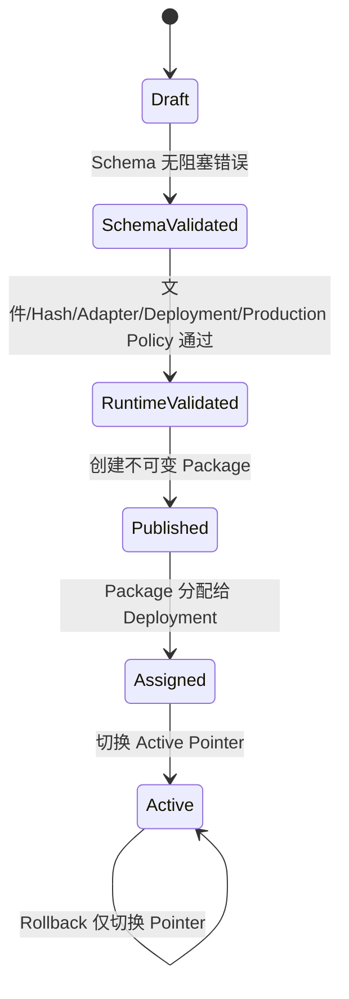

# V2 配置迁移与发布

## 1. 正式对象与持久化边界

schema v2 的根对象是 `ProjectConfigurationV2`，包含：

- ProjectId、Name、Workstation；
- ModelArtifacts 与 RuntimeProfiles；
- InputSourceDefinitions；
- 无序 TestStepCatalog；
- TestSequenceVersions 及其有序 OrderedInvocations；
- DeploymentBindings；
- RetiredFunctionCodes。

WPF 的 `InspectionItemPreview`、`ModelPreview`、`PoseStepPreview`、ComboBox SelectedIndex、WPF `Rect` 和窗口字符串字段不进入 JSON。`V2DraftMapper` 把 UI 状态转换为 enum、Guid、稳定 ID 和正式对象；加载时再从正式对象还原编辑状态。

当前 WPF 不再显示独立 Sequence Plan。测试步列表从上到下是唯一可编辑执行顺序，保存时每个测试步自动生成一个 `StepInvocation`；加载旧 Draft 时使用每个 Step 的第一个有效 Invocation 恢复列表顺序，额外重复 Invocation 不在当前前端继续呈现。Core schema 与 Runner 的 `OrderedInvocations` 契约保持不变。

便携 Recipe 与现场部署信息分离：Project/Sequence/Step 保存逻辑引用；PLC 地址、连接 Profile、相机设备地址、Line 点位表和 Adapter Allowlist 保存于 `DeploymentBinding`。

## 2. 本地布局

默认根目录：

```text
%LocalAppData%\VisualInspectionTestDeployment\v2-configuration\
  last-draft.txt
  drafts\<draft-id>.json
  packages\<package-id>.json
  assignments\<deployment-binding-id>.json
  active\<deployment-binding-id>.json
```

Draft、Assignment 和 Active Pointer 通过同目录临时文件后原子替换。Package 使用 Create-New 写入；目标文件存在即失败，不允许覆盖。

## 3. 生命周期



规则：

1. 保存 Draft 不等于校验或发布；每次编辑会使已有校验失效并回到 Draft。
2. Schema 有错误时不执行 Runtime Validation，避免用外部探测噪音掩盖结构错误。
3. 只有 Schema 与 Runtime 同时通过时 `CanPublish=true`。
4. Publish 会再次执行完整双重校验，不能只信任 UI 状态。
5. Published Sequence Snapshot 标记 `IsPublished=true`，写入 PublishedAtUtc 与 ContentHash。
6. PackageId 由 `SequenceId + Version` 的 SHA-256 确定性派生；同一 Sequence Version 再发布会命中同一 Package 路径并失败。
7. Assign 只接受 Package Snapshot 内存在的 Deployment Binding。
8. Activate 只接受当前已 Assigned Package，并记录 PreviousPackageId。
9. Rollback 只写新的 Active Pointer，不修改 Package、Assignment 或历史 Snapshot。

## 4. 发布包内容和 Hash

`PublishedConfigurationPackage` 保存：

- PackageId 与 SchemaVersion；
- Project Snapshot；
- Published Sequence Version；
- 实际被 Invocation 引用的 Model Artifact References；
- ContentHash；
- CreatedAtUtc 与 CreatedBy。

ContentHash 对规范化的 Project Snapshot、Sequence 和模型引用执行 SHA-256。模型引用至少固定 Artifact ID、Version、SHA-256、Adapter ID 和 Runtime Profile ID。模型实际文件仍由 Runtime Validation 校验存在性与 Hash；Package 不把模型二进制复制进 JSON。

## 5. 发布前校验

Schema Validation 覆盖：

- SchemaVersion、必填字段与 Guid；
- 引用完整性、Model Version/Label ID/Profile/Adapter 一致性；
- FunctionCode 唯一、退休码不可复用、已发布引用不可静默改码；
- Sequence Order 连续且唯一、Invocation Policy、Delay/Timeout/Capture/Failure；
- RuleSet AND/OR、比较/阈值、Confidence、ROI Geometry；
- Pose Action Order、Model Binding、Hold/Wait/Program Timeout；
- External Trigger Binding、队列、并发、去抖、延时和超时；
- Deployment Binding 结构。

Runtime Validation 覆盖：

- Model File/`file://` URI、SHA-256 与 Adapter Contract Probe；
- Runtime Profile 与任务类型；
- Sequence 所需 Source、Trigger 和 Line Deployment Mapping；
- Adapter 注册和 Probe；
- Production Allowlist、Manifest/模拟器/未配置实现和调试选源禁用策略。

校验问题继续使用稳定 `Code + Path + Message + Severity`，内部 Publish 命令在存在 Error 时保持禁用。当前设置向导的最终页不显示 Publish 或生命周期状态，而是分别提供“应用到当前操作台”和“导出 Sequence 与模型”：前者通过兼容转换加载当前工作台，后者生成一个可移植 `.sequence.json` 及其引用模型；导出器会移除机台本地 Deployment Binding，Folder 图源在接收端使用同目录 `input` 约定。两者都不等同于生命周期 Published Package。

v1 迁移生成的稳定 `FunctionCode` 使用大写 ASCII 前缀与大写 GUID 摘要，确保中文测试步名称也满足 schema 的 `^[A-Z][A-Z0-9_-]{2,63}$` 约束；原始测试步 GUID 仍作为稳定身份保留。

## 6. schema v1 到 v2

`JsonConfigurationLifecycleStore.LoadPortableProjectAsync` 同时识别 v1 信封和 v2 根对象。v1 通过 `ProjectConfigurationV1Migrator` 内存迁移，不覆盖原文件。

| v1 | v2 迁移 |
| --- | --- |
| Project ID/Name/Workstation | 原值保留 |
| Model | `ModelArtifact`；保留 ID、版本、文件、SHA、标签，派生 CPU Runtime Profile |
| Detection ONNX | `onnx-yolo-e2e-detection`；仍需 Runtime Contract Probe |
| PT/其他任务 | 对应未配置 Adapter ID；不会伪装 Ready |
| InputSource | `InputSourceDefinitionV2`；原 ID 同时作为 Source Binding ID |
| TestSequenceItem | 去重为 `TestStepDefinition`，原 Item ID 作为 StepId |
| Item 名称 | 名称保留；FunctionCode 从名称和 StepId 确定性生成 |
| Item Order | 只迁移到 `StepInvocation.Order`；Catalog 不承载顺序 |
| Required/Delay | 迁移到 Invocation；必选项默认 StopSequence，可选项 ContinueSequence |
| 普通规则/ROI | 保留 Rule ID、Binding、Label、比较、阈值、Confidence、Outcome 和几何 |
| PoseStep | 保留 Action ID、Order、Condition、Binding、Confidence、Hold、Wait、Required |
| 发布标志 | 保留并为旧 Sequence 计算兼容 ContentHash |
| 现场连接 | 已知 Folder 路径或 Camera Device ID 写入一个确定性迁移 Deployment Binding，供“应用到当前操作台”保留当前图源；Camera/Line Adapter 仍标记未配置，不猜测 PLC、Line 点位或现场协议 |

迁移使用确定性 Guid 派生 Runtime Profile、Invocation ID 和 Deployment Binding ID，重复加载相同 v1 文件得到相同身份。已存在的 Folder 路径或 Camera Device ID 属于源配置事实，会原样保留；迁移不写入虚假的 PLC、相机协议或 Line 地址，也不会把 `detections.json` 升格为生产模型。便携 sequence 导出仍主动移除该机台本地 Deployment Binding。

## 7. FunctionCode 维护

- FunctionCode 在项目内不区分大小写唯一。
- Step 重命名只改 Name。
- 删除 Step 时把代码加入 `RetiredFunctionCodes`。
- 创建新 Step 时需显式避开现存和退休代码。
- 已发布 Package 是历史权威；后续修改必须产生新的 Sequence Version 和 Package，不能覆盖旧版本。

## 8. 内部生命周期操作（当前前端不展示）

以下命令和 ViewModel API 仍保留供后续功能阶段使用，但当前五步向导底栏不显示也不调用这些操作：

1. “保存草稿”：把当前 UI 映射为 schema v2，原子写入 Draft，并更新 `last-draft.txt`。
2. “加载草稿”：从上次 Draft ID 加载正式对象，再恢复 UI，并按确定性 Package ID 与 Deployment Binding 恢复已持久化的 Published、Assigned 和 Active 状态；集成窗口打开时自动尝试加载。
3. “校验”：先保存当前状态，再运行 Schema 与 Runtime Validation。
4. “发布”：仅在双重校验通过时可用，创建不可变 Package；发布后校验状态失效，防止重复点击发布同一版本。
5. “分配”：把 Package 关联到 Deployment。
6. “激活”：切换该 Deployment 的 Active Pointer。
7. “回滚”：切换到 Previous Package，不修改任何历史 Package。

## 9. 兼容与尚未切换的边界

- v1 项目 JSON、旧 Runner、`--acceptance-smoke` 和既有 Operator 工作台继续可用。
- V2 Draft/Package 使用独立目录，不覆盖 `%LocalAppData%\VisualInspectionTestDeployment\projects` 中的 v1 配置。
- 当前 Operator 主执行入口尚未改为读取 V2 Active Pointer。把它切换到 V2 前，必须补启动恢复、真实 Adapter 注册、现场点位配置、硬件在环和回退演练。
- 当前 V2 Production 校验会因缺少真实 Camera、Trigger、Line Adapter 保持 NotReady；这是安全门禁的预期行为。
