# Visual Inspection Test Deployment 技术架构与开发计划

| 项目 | 内容 |
| --- | --- |
| 文档版本 | v2.1 |
| 当前里程碑 | v1 兼容运行链 + 可移植 sequence 交付与 8.27 操作端增量 |
| 最近核验日期 | 2026-08-27 |
| 强制开发语言 | C# |
| 需求基线 | [软件需求规格说明](./软件需求规格说明.md) |
| UI 基线 | [前端 UI 概要设计](./前端UI概要设计.md) |
| 验收入口 | [验收说明](./验收说明.md) |

## 1. 当前实现基线

代码已形成可构建、可测试、可发布和可端到端冒烟的 C#/.NET 8 WPF 应用。C# 是不可替换的产品开发语言；PowerShell 只负责构建与验收编排，厂商原生组件必须封装在 C# Infrastructure 适配器之后：

- 操作工工作台复用 `main` 的单页三栏结构，测试序列、采集帧/当前项和全局统计同屏；显式验收用 Fan 序列只保留一个“风扇检测”测试步，该步内部以 AND 组合 6 条检测标签规则；主界面提供 sequence 导入，Camera 开始时弹窗录入序列号，Folder 则以每张图片文件名派生序列号；当前项表格按 sequence 显示中文检测标签、判定逻辑、本次实测和红/绿 Result，检测图保留原始图片、模型原始英文 Output Label 与检测框，不显示 Target 中文名或置信度；
- 操作工工作台、管理员图源页、示例数据、状态、日志与运行异常提示已统一为简体中文；
- Admin Input Source Settings 支持 Folder 选择、策略配置、校验、预览和保存；
- `v1.0.0` 标签中的 Admin Test Sequence Settings 继续作为兼容配置入口；当前 V2 保留五步 WPF 向导，显式向导预览夹具型号 `FAN-A01` 只放置一个“风扇检测”测试步并在其内部预置 6 个检测标签规则。所有设置端测试步统一参与产品总判定，不暴露“是否必选”。图源页把图片文件夹与视频文件夹设为互斥选项并分别保留路径，USB/工业相机仅显示灰态“待开发”。模型库允许删空；ONNX 标签读取后可通过加号、减号和直接编辑维护。新增测试步或改选模型时使用独立兼容模型弹窗。每个检测标签默认一个 ROI，先导入参考背景图再按原比例框选；置信度阈值非必填且默认 `0.5`。最终一步可直接应用到当前操作台，或独立导出 `.sequence.json` 与引用模型；视频读取、图像分割推理和自定义函数执行仍受运行时门禁；
- 经典设置仍可新增/删除普通检测项，并编辑模型/标签、目标主绑定、普通规则、ROI、姿态步骤和延时后统一校验保存；新增普通检测项由 Core 编辑器生成可校验的默认规则，删除后统一压缩测试项顺序；
- ONNX 标签读取器流式扫描 `ModelProto.metadata_props`，支持四种常见标签键及 JSON/Python 风格映射，不加载大体积模型图到内存；
- `OnnxYoloInspectionProvider` 已通过 Microsoft ONNX Runtime CPU 执行静态 `Float[1,3,H,W]` 输入、端到端 `Float[1,N,6]` 输出的 Detection 模型；SkiaSharp 完成编码图像解码、Letterbox、RGB/0–1 张量化，输出框还原为原图坐标；
- 真实 ONNX 输出按 Class ID 映射到显式 Target/Model Binding，并继续复用现有置信度、Full Image/ROI、规则、叠加层、统计与日志链；契约探测失败时不会进入 Ready；
- `TargetDetection` 把目标、模型绑定、像素框和置信度统一为运行观察；`SpatialDetectionCounter` 按 Full Image/ROI、中心点、参考尺寸和置信度生成实际数量；
- V2 ROI 编辑器默认单 ROI，并要求先导入参考背景图再通过坐标或鼠标框选；WPF 使用 `Uniform` 计算实际图像视口，框选只在该视口内生效，`V2DraftMapper` 保存导入图像的参考像素宽高；姿态步骤通过线性动作画布展示并支持顺序调整；Core 仍保留兼容旧配置的多 ROI 数据能力；
- 中文登录窗口、本地 JSON 账户、PBKDF2-SHA256 密码哈希和 Admin/Operator 会话隔离已接入；Operator 会话不显示设置入口，Admin 会话从同一工作台只进入 V2 测试序列设置，图源统一位于向导第 02 步；
- v1 兼容路径继续使用 schema v1；新 `ProjectConfigurationV2` 保存 Artifact/Profile、无序 Step Catalog、有序 Sequence Version、独立 Deployment Binding、RuleSet、Pose Program、Trigger Contract 与退休 FunctionCode；
- 新 `VisualInspection.Runner` 是 V2 唯一序列编排组件，按 `OrderedInvocations` 执行，处理有界队列、幂等、关联、四种采集策略、超时/取消/迟到丢弃、共享 Observation 和安全 Line Result；旧 `TestSequenceRunner` 继续服务现有 Operator 兼容入口；
- `FolderBatchTestSequenceRunner` 保留离线整文件夹批量能力，并新增 `RunSingleAsync` 供 Operator 单件运行；`MainWindowViewModel` 以会话游标选择下一张 Folder 图片并用文件名派生序列号，多个普通项复用一次 `FrameInspectionObservation`；Camera 图源在每次开始前请求一个非空序列号；
- 业务 Fail、系统 Error 和人工 Stopped 分离；Stop 保留已完成项，Stopped Run 不计入会话 Pass/Fail；
- Folder 图源和内置验收清单构成可复现执行链，当前图片、精确 ROI、检测框、模型原始英文 Output Label、实测值、项目状态与统计实时更新；图像叠加层不显示 Target 中文名或置信度，但规则仍用 Target 和置信度筛选。当前项表格运行前从当前 sequence 预加载全部标签规则及 AND/OR 组合，运行后按规则指标显示在场数量、缺失数量或存在状态，并以红/绿 Result 表达规则结果。Detection 框和 ROI 在原图像素空间按相对 `640 × 360` 的分辨率比例放大；
- v1 JSON 项目和 V2 Draft/Assignment/Active Pointer 均使用临时文件原子替换；V2 Published Package 只允许 Create-New，运行事件按天追加为 JSON Lines。`ProductionResultStore` 同步写生产 TXT 与结果图片：字段顺序固定为 `机台|日期|时间|工站|型号|员工号|序列号|测试结果|图片地址|`，图片按 Pass/Fail 分目录并以序列号、时间和结果命名；
- `PortableSequenceFile` 把一个 V2 型号序列和引用模型导出为 `.sequence.json` 加同目录模型，写入前计算并固化 SHA-256，并主动剥离机台本地 Deployment Binding；导入只允许同目录模型文件名，并校验 schema、单序列约束、文件与 hash，再由 `ProjectConfigurationV2CompatibilityConverter` 映射到当前受支持的 v1 ONNX Detection Operator 运行链。设置窗口的“应用到当前操作台”复用同一兼容转换，并由 `ApplicationBootstrapper.LoadConfiguredSequenceAsync` 在成功探针后持久化和重建工作台；失败不替换当前窗口。Folder sequence 使用同目录 `input` 作为明确默认值；图源未就绪时开始门禁保持关闭。不支持的任务或 Adapter 失败关闭；
- 显式验收命令按需生成型号 `FAN-A01` 的 Fan PASS/FAIL 两组数据，正常启动保持未加载且不生成示例；每组含 12 张 640 × 360 BMP 和一份 `detections.json`，可分别复现单个“风扇检测”测试步内 6 条 AND 规则的完整 PASS 与反向标签 FAIL。前端演示单文件另将已验证的 `fan.onnx` 和 `IMG_1533.JPG` 作为嵌入资源，在显式验收或代表性 Sequence 导出时原子解包到本机应用数据目录；正常启动仍等待显式导入；
- v1 兼容运行时仍优先使用受支持 ONNX，并可回退 `detections.json` 做确定性验收；V2 Production 禁止 Manifest、模拟器、未配置 Adapter 和操作员调试选源，缺少真实 Camera/Trigger/Line Adapter 时保持 NotReady。DirectShow、厂商 SDK 和现场协议仍未安装。

## 2. 分层与依赖

| 项目 | 当前职责 | 依赖边界 |
| --- | --- | --- |
| `VisualInspection.App` | WPF Operator 工作台、经典设置页、V2 五步 View/ViewModel、正式 Draft 映射与生命周期命令、预览/冒烟编排 | 依赖 Core、Infrastructure；不承载发布或 Runner 状态机 |
| `VisualInspection.Core` | v1 兼容域逻辑；V2 schema/验证、Trigger/Capture/Frame/Adapter 契约、规则、Pose 与 Line 状态机 | 不依赖 WPF、ONNX Runtime、SkiaSharp 或厂商 SDK |
| `VisualInspection.Infrastructure` | Folder、ONNX Runtime CPU、编码/原始帧预处理、V2 Adapter/Registry/Runtime Validation、配置生命周期存储、日志 | 实现 Core 契约，不向 Core 泄漏厂商类型 |
| `VisualInspection.Runner` | V2 Trigger Dispatch、Capture Coordinator、Step Executor、Sequence Orchestrator 和 Result Publication | 依赖 Core/Infrastructure 契约，不依赖 WPF |
| `VisualInspection.Core.Tests` | v1 兼容规则、配置、Folder、ONNX 与 Runner 回归 | 依赖 Core、Infrastructure |
| `VisualInspection.V2.Tests` | schema/生命周期、Trigger/Frame、Runner、Pose、Line、Production Policy、帧预处理 | 依赖 Core、Infrastructure、Runner |
| `VisualInspection.App.Tests` | WPF 编辑状态与正式 V2 Draft 的双向映射 | Windows WPF 测试项目 |

解决方案内产品与测试项目均为 C# `.csproj`。不得新增 Python、C++、JavaScript/TypeScript 产品实现分支；必须使用的厂商原生二进制通过 C# 互操作边界接入，并保持 Core 纯 C#、无厂商依赖。

核心执行流：

```text
Test Sequence
  → Folder 普通序列：依次 Read 全部图片
  → 每张图片执行完整 Test Sequence
  → IInspectionProvider.Analyze(frame)，同图普通项共享观察
  → Target count / Action observation
  → CountRuleEvaluator or pose state machine
  → Item Pass / Fail / Error
  → Run result
  → Operator UI + session statistics + JSONL log
```

同一普通测试项中的多条规则共享同一帧；默认 Fan 配置因此把 6 条标签规则放在同一个“风扇检测”测试步中，而不是拆成 6 个测试步。纯普通 Folder 序列进一步以每张图片作为一个 Test Run：该图片依次执行全部普通项，但只调用一次底层模型分析，避免测试项数量放大推理开销；逐图结果分别进入会话统计。含姿态项的序列不使用该批量模式，仍把 Folder 视为连续帧流。`IInspectionProvider` 将帧转换为目标数量和动作观察；`OnnxYoloInspectionProvider` 提供受支持契约的真实 ONNX Detection 输出，`ManifestInspectionProvider` 提供无模型时的确定性回归输出，两者都生成相同的 `FrameInspectionObservation`。

V2 执行链与上述 v1 兼容链独立：

```mermaid
flowchart LR
    A[PLC/传感器] --> B[Trigger Adapter]
    B --> C[Trigger Event]
    C --> D[Sequence Orchestrator]
    D --> E[Capture Request]
    E --> F[Camera Adapter]
    F --> G[Frame Envelope]
    G --> H[Model Adapter]
    H --> I[Rule/Pose]
    I --> J[Sequence Aggregation]
    J --> K[Line Result Handshake]
    K --> L[Test Record]
```



完整契约、安全语义和现场接入点见 [V2 生产架构设计](./V2生产架构设计.md)。当前 Operator 主执行入口尚未切换到 V2 Active Pointer，因此不能把新 Runner 的测试通过描述为真实产线已启用。

## 3. 规则与时序语义

数量指标：

- `PresentCount`：当前目标数量；
- `MissingCount`：$\max(期望数量-实际数量, 0)$；
- `Presence`：数量大于 0 时为 1，否则为 0。

比较支持 `Equal`、`NotEqual`、`GreaterThan`、`GreaterThanOrEqual`、`LessThan`、`LessThanOrEqual` 和 `BetweenInclusive`；多规则以 AND/OR 汇总。每条规则可定义匹配时输出 Pass 或 Fail，例如“瑕疵数量 > 0 时 Fail”。Error 只表示执行异常，不能配置成业务规则结果。

姿态时序采用 P0 固定线性状态机：

1. 只检查当前步骤的 `ActionCondition`；
2. 条件必须连续满足 `MinimumHoldMs`；
3. 满足后进入下一步；
4. `MaximumWaitMs` 到期或文件序列结束时，该姿态项 Fail；
5. Folder 使用 `PoseFrameIntervalMs` 作为帧时间，同时在验收播放中按该间隔展示。

以上是 v1 兼容 Runner 语义。V2 `PoseProgramStateMachine` 改用实际 Frame 时间戳与单调 elapsed time，并显式处理未来动作提前、顺序错误、连续保持中断、丢帧/异常间隔、单动作超时和 Program 总超时；Hold、Wait、Confidence 与 Model Binding 按动作独立保存。

## 4. 输入与分析适配器

### 4.1 `IImageSource`

现役契约提供 `OpenAsync`、`ReadAsync`、`ResetAsync`、`CloseAsync`、状态、进度和统一 `ImageFrame`。Folder 已实现：

- `.jpg`、`.jpeg`、`.png`、`.bmp`；
- 自然文件名/修改时间排序；
- 可选子目录；
- 损坏文件 Skip/Stop；
- 循环播放及全部坏图空转保护；
- 编码图像宽高解析与来源路径。

`FolderBatchTestSequenceRunner` 打开 Folder 一次并持续读取到结束。每个有效文件产生独立 `TestRunResult`，业务 Fail 不阻断后续图片，模型/规则 Error 会保留已完成结果并停止，人工取消不会把未完成图片计入统计；图源自身继续负责损坏文件 Skip/Stop 和失败计数。

`ImageSourceFactory` 已为 DirectShow 和厂商相机保留分支，但当前明确抛出未安装错误。Admin 页可以保存相机配置用于后续集成，不能验证或启动。

### 4.2 分析与模型边界

- `IInspectionProvider`：Runner 所需的统一帧观察接口；
- `OnnxYoloInspectionProvider`：真实 ONNX Runtime CPU 适配器；启动和开始测试前检查模型文件、任务类型及输入/输出张量契约，运行时按显式 Label/Target/Binding 生成 `TargetDetection`；
- `ManifestInspectionProvider`：读取图片目录旁的 `detections.json`，把空间检测框与动作转换为统一观察，只用于 v1 兼容验收或 V2 Acceptance/测试；
- `IModelInferenceRuntime`：后续 PT、其他 ONNX 任务和厂商运行时的扩展契约；
- v1 兼容工作台在受支持 ONNX 就绪时优先执行真实推理，否则可回退到 `detections.json`；两者都不可用时 Start 禁用。V2 Production 不采用该回退链，Manifest 被 Runtime Policy 明确拒绝。

内置清单同时保留旧版 `targetCounts` 兼容字段，并提供像素检测框。存在 `detections` 时 Runner 不使用预计算数量，而是按 Target、Model Binding、Confidence 和当前 Rule Scope 实际计数；ROI 默认以框中心点归属，参考尺寸与帧尺寸不同时按比例换算，旧配置中的多个 ROI 取并集且每个框只计一次。`MainWindowViewModel` 合成叠加图时以 `640 × 360` 为视觉参考尺寸，对 Detection 实线、通过 Model Binding/Output Label 回查出的模型原始英文标签文字和 ROI 虚线做同倍率缩放；Target 中文名与 Confidence 不绘制到检测图。该回退链可验证空间筛选、规则、Delay、姿态状态、叠加图、UI 和日志，但不能替代真实模型精度或相机性能验证。

### 4.3 ONNX 标签元数据

`OnnxModelLabelImporter` 直接解析 ONNX protobuf 顶层字段 14（`metadata_props`），识别大小写不敏感的 `names`、`labels`、`class_names` 和 `classes`。标签值支持 JSON 对象/数组、常见 Python 字典/列表以及“编号=名称”文本，并统一校验非负编号、非空名称和编号唯一性。

解析器只分配最大 1 MB 的单个元数据项，未知的大字段通过流定位跳过；截断、无标签、非法 UTF-8 和不支持格式都会明确失败。`.pt` 可能包含可执行 pickle，当前版本不会直接反序列化；待现场确认 Ultralytics、TorchScript 或自定义 Checkpoint 契约后，必须通过受控运行时读取。

### 4.4 现役 ONNX Detection 契约

v0.6.0 冻结首个真实模型适配器的契约：

- 单输入、单输出；输入元素为 Float，固定形状 `[1,3,H,W]`；
- 编码 JPG/JPEG/PNG/BMP 由 SkiaSharp 解码，按长边等比例缩放并以 RGB `114` 填充到模型尺寸，通道转换为 RGB，数值归一化到 0–1；
- 输出元素为 Float，固定形状 `[1,N,6]`，每行依次为 `x1,y1,x2,y2,confidence,classId`，模型内部已完成端到端候选筛选；
- 输出框去除 Letterbox Padding 后还原到原图像素坐标并限制在图像边界；低于所用规则最小置信度、未绑定 Class ID、零置信度或退化框被忽略；
- 同一个 Class ID 可映射到多个显式 Target/Binding；规则层仍会再次按自己的置信度与区域筛选；
- 当前使用 CPU Execution Provider。动态输入、原始 `[1,C,N]` YOLO 输出、外置 NMS、Classification、Segmentation、Pose/Temporal 尚未接入，不得标记为 Ready。

2026-08-14 使用现场 `fan.onnx` 核验：Ultralytics YOLO26x，输入 `Float[1,3,640,640]`，输出 `Float[1,300,6]`；在 5712 × 4284 的 `IMG_1533.JPG` 上识别 7 个绑定目标，当前开发机单次 CPU 分析约 0.55–0.70 秒。该数值是接入冒烟观测，不是正式节拍指标。

### 4.5 V2 Adapter 与运行时门禁

Core 已定义 `ITriggerAdapter`、`ICameraAdapter`、`IModelRuntimeAdapter` 和 `ILineResultAdapter`；Infrastructure 已提供注册表、模拟器和 fail-closed 未配置实现。Trigger Signal Tag 与现场地址的映射由 `DeploymentBinding` 保存，不进入便携 Step Recipe。`TriggerSignalProcessor`、`FrameCorrelationService` 和 `LineResultHandshakeStateMachine` 分别覆盖沿/电平/去抖、Trigger-Frame-Product 关联，以及 NotReady/Ready/Busy/ResultLatched/Faulted 安全状态。

真实 Trigger、Camera 和 Line Adapter 尚未实现。Production Runtime Validation 会核对 Adapter Allowlist、Production 能力、Probe、模型文件/Hash/Contract、Source/Trigger/Line 映射，并拒绝 Manifest、模拟器、未配置实现和 `OperatorDebugSelection`。当前没有完整真实外围 Adapter 链，因此 Production 必须 NotReady；不得用模拟 Signal Tag 或测试通过证明 PLC、IO、相机或产线已连接。

## 5. 配置、日志和本机数据

```text
%LocalAppData%\VisualInspectionTestDeployment\projects\<project-id>.json
%LocalAppData%\VisualInspectionTestDeployment\users\users.json
%LocalAppData%\VisualInspectionTestDeployment\acceptance-data\fan-pass\
%LocalAppData%\VisualInspectionTestDeployment\acceptance-data\fan-fail\
%LocalAppData%\VisualInspectionTestDeployment\bundled-fan\models\fan.onnx
%LocalAppData%\VisualInspectionTestDeployment\bundled-fan\input\IMG_1533.JPG
%LocalAppData%\VisualInspectionTestDeployment\logs\inspection-YYYYMMDD.jsonl
%LocalAppData%\VisualInspectionTestDeployment\results\logs\inspection-results-YYYYMMDD.txt
%LocalAppData%\VisualInspectionTestDeployment\results\images\pass\
%LocalAppData%\VisualInspectionTestDeployment\results\images\fail\
%LocalAppData%\VisualInspectionTestDeployment\acceptance-smoke-result.json
%LocalAppData%\VisualInspectionTestDeployment\v2-configuration\drafts\<draft-id>.json
%LocalAppData%\VisualInspectionTestDeployment\v2-configuration\packages\<package-id>.json
%LocalAppData%\VisualInspectionTestDeployment\v2-configuration\assignments\<deployment-id>.json
%LocalAppData%\VisualInspectionTestDeployment\v2-configuration\active\<deployment-id>.json
```

v1 `ProjectConfigurationValidator` 与项目文件保持兼容。V2 使用 `ProjectConfigurationV2Validator` 和 `RuntimeConfigurationValidator` 分两层检查结构/引用/FunctionCode/Order/Rule/ROI/Pose/Trigger/Deployment，以及模型文件、SHA-256、Adapter Contract/Probe 和 Production Policy。`JsonConfigurationLifecycleStore` 可加载 v1 或 v2 便携配置；v1 通过确定性迁移映射为 v2，但不覆盖原文件。迁移只把已有 Folder 路径或 Camera Device ID 写入确定性的本地图源 Binding，不猜测 PLC、Line、相机协议或其他现场连接；可移植导出继续剥离该 Binding。

V2 生命周期为 Draft → SchemaValidated → RuntimeValidated → Published → Assigned → Active。Published Package 保存项目 Snapshot、Sequence Version、模型引用、ContentHash、创建人和时间，且禁止覆盖；Rollback 只切换 Active Pointer。详见 [V2 配置迁移与发布](./V2配置迁移与发布.md)。

本地账户通过 `JsonUserAccountStore` 原子写入；密码采用每账户随机盐、100,000 次 PBKDF2-SHA256 和固定时间比较。首次运行生成管理员/操作员验收账户。当前实现只覆盖本地登录和角色隔离，尚未提供账户增删、改密、锁定策略、外部身份源和生产密钥治理。

v1 JSONL 日志包含 UTC 时间、级别、事件、项目项名称、消息和可用时的 Run ID，继续用于诊断和审计。生产 TXT 使用会议冻结的九列管道分隔格式，每次单件完成时与 Pass/Fail 图片一起落盘；写入失败不会被伪装为检测成功，并会进入内部错误日志。V2 `TestRecord` 已定义并由新 Runner 生成，记录环境、Provider/Adapter、Sequence Version、Trigger Sequence Number、幂等键和起止时间；历史查询和配置 diff 仍待实现。

## 6. 发布与验证

Release 是 framework-dependent `win-x64` 发布，入口为：

```text
artifacts\acceptance-zh-CN\VisualInspection.App.exe
```

验证链：

```powershell
dotnet test VisualInspection.sln -c Release
dotnet format VisualInspection.sln --verify-no-changes --no-restore
dotnet publish src\VisualInspection.App\VisualInspection.App.csproj -c Release -r win-x64 --self-contained false -o artifacts\acceptance-zh-CN
powershell -ExecutionPolicy Bypass -File scripts\Invoke-AcceptanceSmoke.ps1
```

`--acceptance-smoke` 继续验证 v1 兼容 Folder、Manifest 和 Runner 的确定性闭环，并断言 Fan 回执只有一个测试步且汇总 6 条规则；退出码 `0/2/3` 分别代表 Pass/Fail/Error。`--ui-construction-smoke` 实际创建和布局所有窗口，并覆盖 Folder 文件名序列号、Camera 序列号弹窗构造、检测图只叠加模型原始英文 Output Label 与框且不显示 Target 中文名或置信度、sequence 驱动的检测标签/判定逻辑/本次实测/Result 表、V2 五步导航、模型删空与标签增删改、兼容模型弹窗、单 ROI 背景图门禁、可选 `0.5` 置信度、sequence 导入/导出入口及 ToolTip/必填标记。Core/Infrastructure 定向测试验证 sequence 导出/导入/hash 门禁、生产 TXT/图片格式、`RunSingleAsync` 和 JSONL 字段。V2 Core/Infrastructure/Runner 的 schema、生命周期、Trigger/Frame、队列、Pose、Line、Production Policy 和预处理继续由 `VisualInspection.V2.Tests` 覆盖；这些自动证据不证明视频、图像分割、PT、真实 Camera/PLC/Line 或工厂序列号策略已接入。

8.31 代表性交付包使用 `scripts\Build-SequenceDelivery.ps1` 生成，包含 `FAN-A01.sequence.json`、其引用且按型号命名的 `FAN-A01.onnx`、生产商操作台接入说明、`input\IMG_1533.JPG` 运行验证图和覆盖全部文件的 `SHA256SUMS.txt`。生产商只消费 Sequence 与模型并开发操作台，不实现本项目的设置端、配置发布、生命周期或格式迁移；JSON 内型号为 `FAN-A01`，项目与模型显示名使用相同代码前缀。代表图只用于让当前兼容 Folder 操作台导入后立即就绪，不属于生产图片或模型性能证据；脚本不执行夸克上传或任何外部发布。

`--operator-preview` 可跳过登录直接打开 Admin 视角的工作台；`--v2-wizard-preview` 及 `--v2-wizard-*-preview`/`snapshot` 可定位 V2 页面做视觉回归。真实 PLC、相机和生产 Adapter 不属于这些自动冒烟的证明范围。

## 7. 里程碑状态

| 里程碑 | 范围 | 当前状态 |
| --- | --- | --- |
| M0 | 需求规格与 Operator UI 概要 | 已完成 |
| M1 | WPF 工作台与统计 | 三栏工作台、空启动及显式导入、Fan 验收夹具一个“风扇检测”测试步内含 6 条 AND 规则、Camera 序列号弹窗、Folder 文件名序列号、单件单图、JSONL + 生产 TXT/Pass-Fail 图片、检测图原图/模型原始英文 Output Label/检测框（无 Target 中文名与置信度文字）及 sequence 驱动的标签判定逻辑/实测/红绿 Result 表均已接入；工厂序列号格式与重复策略待接 |
| M2 | schema 与配置生命周期 | v1 兼容保留；schema v2、Draft、双重校验、不可变 Package、Assignment、Active Pointer、Rollback 和 v1→v2 迁移完成 |
| M3 | 统一图源、Folder、Admin 图源页 | Folder 完成；DirectShow/厂商适配待接 |
| M4 | 真实模型、标签导入、空间输出归一化 | 静态输入 + 端到端 `[1,N,6]` 的 ONNX Detection CPU 运行时、标签读取、空间框、ROI 计数与叠加完成；其他 ONNX 契约和 PT 待接 |
| M5 | Runner、Delay、结果、统计、日志 | v1 离线批量兼容保留；Operator 普通 Folder 已切换为文件名单序列号单图 `RunSingleAsync`，结果写入 JSONL、冻结格式生产 TXT 和 Pass/Fail 图片；独立 V2 Orchestrator、Trigger/Capture/Step/Result 组件、有界队列、迟到丢弃、TestRecord 完成，Operator 原生切换 V2 Active Pointer 仍待现场集成 |
| M6 | 姿态时序 | v1 固定线性兼容；V2 实际时间戳/单调时钟状态机完成，真实姿态模型输出待接 |
| M7 | 登录/RBAC、历史、正式发布验收 | 本地登录与角色隔离、V2 本地不可变发布/激活/回滚完成；生产账户、历史查询和现场发布验收待开发 |
| M8 | Test Sequence Setting V2 顺序向导 | 五步视觉保持；生产型号示例 `FAN-A01`、测试步统一参与总判定、可悬停 ToolTip、模型删空、标签加减与直接编辑、选择模型弹窗、一个默认 ROI + 原比例背景图映射、检测标签命名、必填标记、可选 `0.5` 置信度、直接应用当前操作台及独立 `.sequence.json` + 模型导出已接入；操作端也可导入并映射到受支持的 ONNX Detection 兼容链。视频读取、图像分割推理、自定义函数和其他模型 Adapter 待开发 |
| M9 | V2 生产 Adapter | Core 接口、模拟器、未配置 fail-closed 实现和 Production Policy 完成；真实 PLC、相机、Line、GPU 与其他模型任务 Adapter 待现场信息 |

## 8. 下一阶段外部依赖与决策

- `.pt` 来源必须明确为 Ultralytics、TorchScript 或自定义 Checkpoint；
- 首个 ONNX Detection 契约已经冻结；原始 YOLO 输出、动态输入、Classification、Segmentation、Pose 的输入输出契约仍需逐个真实模型确认；
- Detection 计入 ROI 的几何口径已按“检测框中心点位于 ROI 内”冻结；如现场要求按重叠面积，需另行定义并回归；
- 首批工业相机厂商、SDK 版本和硬件需提供；
- 性能基线需结合实际工控机、分辨率、FPS 和模型数量测量；
- 正式身份源、Admin/Operator 账户策略和密码规范需确认；
- 施耐德正式 UI Token、目标分辨率与 Windows 缩放要求需提供。
- 8.27 五步向导与可移植 sequence 交付链已接入；当前操作端通过明确的 v1 兼容转换执行受支持的 ONNX Detection，而不是直接消费 V2 Active Pointer。切换到原生 V2 Operator 前仍需现场运行评审和回退演练。
- 首个真实触发适配器需提供 PLC/IO/传感器品牌、协议或 SDK 版本、连接方式、点位表、边沿/电平语义、断线策略和硬件在环验收环境。

这些依赖不会阻止本地流程验收，但会阻止真实模型/硬件和生产权限验收。
