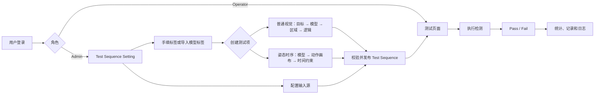

# Visual Inspection Test Deployment 软件需求规格说明书

2026-09-07 启动行为修订：操作台每次正常启动均为未加载状态，不自动创建示例或恢复最近项目；显式导入成功，或管理员完成配置并应用后，才显示具体型号、测试步和规则。空状态禁止检测和复位；导入取消/失败保持原状态，旧配置文件不得因空启动被删除或覆盖。该规则覆盖此前关于默认 Fan 操作台和自动恢复的描述。

| 项目 | 内容 |
| --- | --- |
| 产品正式名称 | Visual Inspection Test Deployment |
| 文档版本 | v2.0 |
| 文档状态 | 需求评审通过 |
| 编制日期 | 2026-08-07 |
| 评审日期 | 2026-08-20 |
| 目标平台 | Windows 桌面端（基于 DirectShow 需求的当前假设） |
| 强制开发语言 | C# |
| UI 设计基线 | [前端 UI 概要设计](./前端UI概要设计.md) |
| 技术实现基线 | [技术架构与开发计划](./技术架构与开发计划.md) |
| 当前交付范围 | [验收说明](./验收说明.md)、[V2 生产架构设计](./V2生产架构设计.md)、[V2 配置迁移与发布](./V2配置迁移与发布.md) |

## 1. 文档目的

本文档把原始业务笔记整理为可设计、可开发、可测试和可验收的软件需求。产品不是单一的 YOLO 部署工具，而是一套能够加载多类视觉模型、组合业务判定逻辑、执行测试序列并汇总结果的工业视觉检测部署端软件。

本文是目标需求基线，不表示每条需求均已实现。当前代码与可验收/未验收边界以《验收说明》为准：schema v2、配置生命周期、独立 Runner、模拟 Adapter、安全状态机和 WPF Draft 绑定已形成架构基础；真实模型仍只实现一种明确的 ONNX Detection CPU 契约，真实 PLC、工业相机、Line、GPU、PT 和其他模型任务未接入，不得依据接口、模拟器或目标需求误判为生产就绪。

文中使用以下优先级：

- **P0**：首个可用版本必须具备，否则核心测试闭环不成立。
- **P1**：建议在首个正式版本具备，可在 MVP 后补充。
- **P2**：增强能力，当前不阻塞核心流程。

## 2. 产品定位与目标

### 2.1 产品定位

Visual Inspection Test Deployment 面向产线或测试工位，用于把视觉模型输出转换为明确的业务判断，并按照预先配置的 Test Sequence 自动执行检测。一个项目内可以同时包含普通视觉检测和姿态时序检测。

### 2.2 核心目标

1. 支持 `.pt`、`.onnx` 等模型，不把系统能力限定为 YOLO。
2. 在模型“检测到/未检测到、是/不是”的基础上增加可配置的逻辑判定。
3. 支持全图和 ROI 区域内的目标数量等式、非等式及范围判断。
4. 支持多目标、多模型以及目标检测、图像分割与姿态时序项混合编排。
5. 通过统一输入接口接入图片文件夹、USB 摄像头和厂商相机 SDK/API。
6. 为管理员提供完整设置能力，为操作员提供直接、清晰的测试界面。
7. 实时显示 Pass/Fail、数量、合格率和运行日志，满足工业测试追溯需要。

### 2.3 当前不包含的范围

以下能力未在原始需求中提出，暂不纳入 P0：

- 模型训练、数据标注和模型微调；
- 云端模型市场、远程设备管理和多工厂集中管理；
- 人工修改检测结论或人工放行流程；
- 复杂脚本语言和任意深度的逻辑表达式；
- 未指定厂商的相机 SDK 适配实现。

## 3. 用户角色与权限

| 能力 | Admin | Operator |
| --- | :---: | :---: |
| 登录系统 | 是 | 是 |
| 进入测试页面 | 是 | 是，登录后默认进入 |
| 启动、停止和复位测试 | 是 | 是 |
| 查看当前测试结果与统计 | 是 | 是 |
| 新建或编辑项目 | 是 | 否 |
| 导入、删除和绑定模型 | 是 | 否 |
| 编辑标签、ROI、规则和动作序列 | 是 | 否 |
| 配置图片源或相机 | 是 | 否 |
| 发布 Test Sequence | 是 | 否 |
| 管理用户和角色 | 是 | 否 |
| 查看配置变更审计日志 | 是 | 否 |

权限要求：

- **FR-AUTH-001（P0）**：系统应识别 Admin 和 Operator 两种角色，并在界面和服务层同时执行权限校验。
- **FR-AUTH-002（P0）**：Operator 登录后应直接进入测试页面，自动加载其被分配的或系统默认的已发布 Test Sequence。
- **FR-AUTH-003（P0）**：Operator 不得通过菜单、快捷键、地址跳转或配置文件入口进入设置功能。
- **FR-AUTH-004（P0）**：账号凭据不得明文保存；登录、退出和权限拒绝事件应写入审计日志。
- **FR-AUTH-005（P1）**：Admin 可新增、停用、重置用户账号，并分配角色。

## 4. 核心业务对象

| 对象 | 定义 |
| --- | --- |
| Project | 一个产品、工位或检测方案的配置集合。 |
| Model | 可执行的视觉模型及其格式、任务类型、版本、标签和运行参数。 |
| Label | 模型输出类别，由手工录入或从模型元数据导入。 |
| Target | 业务上要判断的对象，如螺钉、标签、瑕疵或某个动作。 |
| Model Binding | Target 与具体 Model、Model Version、Output Label 之间的显式绑定。 |
| Test Sequence | 按顺序执行的一组测试项，包含输入源、延时和版本。 |
| Test Step | 可独立校验和调用的测试步/功能块，聚合名称、类型、模型绑定、检测内容、判定条件与触发运行参数；V2 设置页中的列表顺序映射为 Sequence 的 OrderedInvocations。 |
| Trigger Binding | Test Step 的调用契约，描述测试序列/外部/手动调用方式、逻辑 Signal Tag、触发条件、去抖和超时；厂商协议连接由适配器负责。 |
| Normal Test Item | 对单帧视觉结果执行区域与数量逻辑的测试项。 |
| Pose Sequence Item | 对连续帧中的动作顺序和时间约束进行判断的测试项。 |
| Region | 规则的生效范围，包括 Full Image 和 ROI。 |
| Rule | 指标、比较运算、阈值、区域和结果映射的组合。 |
| Test Run | 一个产品序列号对 Test Sequence 的完整执行；普通 Folder 示例中，一个 Test Run 只使用排序后的下一张图片。 |
| Folder Batch | 兼容测试/离线探针使用的整文件夹批量执行能力；不得作为 Operator 单序列号运行语义。 |
| Test Record | Test Run、测试项结果、模型版本、配置版本和运行信息的持久化记录。 |

对象关系约束：

- 一个 Project 可包含多个 Model 和多个 Test Sequence。
- 一个 Test Sequence 可混合包含多个 Normal Test Item 和 Pose Sequence Item。
- V2 中每个 Test Step 对应一个当前测试项功能整体，并拥有独立的检测、判定与 Trigger Binding；Signal Tag 不直接保存密码或厂商 SDK 对象。
- 一个 Test Item 可以包含一个或多个 Target Rule。
- 同一 Project 中的不同 Target 可以绑定不同 Model；同一 Target 也可以在不同测试项中绑定不同 Model 或 Model Version。
- 每个实际执行的 Rule 必须能解析到明确的 Model Binding，禁止只按模型文件名隐式关联。

## 5. 总体业务流程



### 5.1 Admin 配置流程

Admin 通过顺序向导完成配置。2026-08-27 SE 会议后，当前流程收拢为 5 个顶层步骤：

1. 填写 Project、工位、型号和版本；每个 sequence 只对应一种产品型号。
2. 在图片文件夹或视频文件夹中选择一种图源并浏览对应文件夹；USB 摄像头和工业相机当前仅显示为待开发。
3. 建立项目模型库：可新增或全部删除 `.pt`/`.onnx` 模型；选择 ONNX 后尝试读取标签，并使用加号、减号或直接改名人工修正，不提供标签来源下拉框。
4. 在“测试步设置”中按列表从上到下新增、删除、选择或移动测试步；设置端的所有测试步都参与产品总判定，不提供“是否必选”开关。新增测试步通过弹窗选择兼容模型；目标检测与图像分割逐个配置检测标签。ROI 只保留一个默认区域，并须先导入标注底图再框选；底图按原始宽高比显示。置信度默认 0.5、可留空并放在规则区底部。
5. 在汇总页检查测试步顺序、检测标签、姿态动作和自定义函数；校验通过后可直接“应用到当前操作台”，或通过独立按钮选择保存位置并导出一个 `.sequence.json` 逻辑文件及其实际引用的模型。

### 5.2 Operator 测试流程

1. 登录后直接进入测试页面。
2. 操作端从“导入测试序列”选择 `.sequence.json`，校验 schema、单型号约束、模型存在性和 SHA-256 后加载所需模型。
3. 系统初始化图片源或相机，并显示就绪状态。
4. Operator 启动测试。
5. 系统逐项执行并显示标准、实测值和 Pass/Fail。
6. 系统更新右侧全局统计，并保存测试记录与运行日志。

## 6. Test Sequence Setting 需求

### 6.1 项目与序列管理

- **FR-SEQ-001（P0）**：Admin 可新建、复制、重命名和编辑 Test Sequence。
- **FR-SEQ-002（P0）**：V2 前端必须只显示一份有序测试步列表，列表从上到下即执行顺序，并支持上下调整。保存时每个列表项自动映射为且只映射为一个有序 `StepInvocation`；不得再显示独立 Invocation Plan，也不得在前端把同一 Step 重复加入执行序列。Core schema 与 Runner 可继续保留 Catalog/OrderedInvocations 分层契约。
- **FR-SEQ-003（P0）**：每个 Test Step 至少包含不可变 StepId、稳定 FunctionCode、名称、类型、模型绑定、RuleSet 或 PoseProgram、Invocation Policy、默认 Timeout 和默认 Frame Input Policy；Required、Delay、Timeout Override、Capture Policy 与 Failure Policy 属于 StepInvocation。
- **FR-SEQ-004（P0）**：Delay 使用非负整数毫秒，默认表示“上一测试项完成后、当前测试项开始前”的等待时间。
- **FR-SEQ-005（P0）**：Test Sequence 可设置默认 Delay；测试项可覆盖该值。
- **FR-SEQ-006（P0）**：发布前应校验模型、标签绑定、ROI、规则、输入源和姿态步骤。存在阻塞错误时不得发布。
- **FR-SEQ-007（P0）**：已发布版本应具备唯一版本号；测试记录必须保存实际使用的版本，后续编辑不得改变历史记录含义。
- **FR-SEQ-008（P1）**：Admin 可将已发布版本回退为当前使用版本，但不得覆盖或删除历史测试记录。
- **FR-SEQ-009（P0）**：Admin 可在测试步列表新增和删除功能。新增项取得唯一 StepId、稳定 InvocationId 和稳定 FunctionCode，并追加到执行顺序末尾；删除时同步移除其执行映射并把 FunctionCode 加入退休集合，避免无提示复用。
- **FR-SEQ-010（P0）**：Test Sequence Setting V2 固定保留“项目信息、选择图源、导入模型、测试步设置、应用与导出”五个顶层步骤；顶部步骤条在可用宽度内整体居中，下方一次只显示当前步骤。
- **FR-SEQ-011（P0）**：步骤卡应区分待设置、正在设置和已完成；只有步骤必填校验通过且 Admin 通过“下一步”确认后才可标为已完成，直接跳到后续步骤不得把中间步骤推定为完成，已完成步骤的必填内容失效时必须取消完成状态。Admin 可通过上一步、下一步或顶部步骤卡回看。检测类型应明确提供目标检测、图像分割与姿态动作，三者均作为测试步类型混合编排，不拆成独立向导步骤。
- **FR-SEQ-012（P0）**：最终步骤应汇总图源、模型、测试步顺序、检测标签、姿态动作和自定义函数，并分别提供“应用到当前操作台”和“导出 Sequence 与模型”。应用先校验受支持的操作端契约，成功后重建当前操作台，失败时保留原配置；导出按钮必须弹出保存位置，写 sequence 前完成 schema 校验，复制模型后记录 SHA-256，逻辑文件最后原子写入，且导出成功不得自动切换操作台或关闭设置窗口。
- **FR-SEQ-013（P0）**：V2 测试步列表应提供加号新增、减号删除、列表选择及上移/下移操作，并明确标注“从上到下执行”；每张卡显示名称和检测类型。设置端的每个测试步都映射为 `IsRequired=true` 并参与产品总判定，不向用户暴露“必选/可选”开关；Core schema 仍可保留旧包兼容字段。新增、删除或移动不得改变其他测试步的稳定 Function Code 或 InvocationId。
- **FR-SEQ-014（P0）**：目标检测、图像分割和姿态测试步都只显示基本信息和自定义函数。新增测试步或更换 Model 必须打开弹窗，弹窗只列出与当前检测类型兼容的模型；没有兼容模型时显示可操作提示。目标检测与图像分割共用逐检测标签配置，切换或改绑模型后移除不兼容旧标签与规则。点选检测标签后打开只属于该标签的 Full Image/单默认 ROI 与判定条件；使用 ROI 时必须先导入设置用底图。姿态测试步选择姿态/时序模型后打开动作顺序配置。图像分割与姿态可配置不代表对应运行适配器已接入。
- **FR-SEQ-015（P0）**：测试步配置必须聚合为一个“测试步设置”顶层步骤，并且只显示“基本信息 / 自定义函数”页签，不得再次呈现为编号二级向导或为姿态类型保留常驻动作页签。目标检测与图像分割的“检测内容”和“判定条件”通过基本信息弹窗配置，姿态动作顺序也通过基本信息触发的临时弹层配置；正式 Trigger Binding、Invocation Policy 和 Runner 调度仍属于 schema v2 生产契约，不得因前端隐藏而删除。
- **FR-SEQ-016（P0）**：每个 Test Step 应定义与列表位置无关的稳定 Function Code、逻辑 Signal Tag、触发条件、非负去抖、非负触发后 Delay、正整数函数超时和帧输入策略；移动列表仅改变执行 Order。外部信号方式缺少 Signal Tag 或触发条件时不得发布；Signal Tag 与 PLC/IO/传感器协议地址的映射必须由 C# Trigger Adapter 隔离，前端字段不得被描述为真实硬件已接入。
- **FR-SEQ-017（P0）**：序列调用、手动调试调用和外部 Trigger Binding 必须独立建模，不得用一个互斥 TriggerMode 表达。外部 Binding 还应保存并发、队列容量、溢出策略和 Frame Input Policy。
- **FR-SEQ-018（P0）**：配置必须按 Draft → Schema Validated → Runtime Validated → Published → Assigned → Active 生命周期推进；Published Package 不可覆盖，Rollback 只能切换 Active Pointer。
- **FR-SEQ-019（P0）**：Sequence Orchestrator 是唯一执行 `OrderedInvocations` 的组件，必须处理幂等、重复触发、有界队列、背压、Deadline、Cancellation、迟到结果丢弃和 Max In-flight；WPF Draft Mapper 必须把当前测试步列表顺序确定性转换为连续且唯一的 Invocation Order。
- **FR-SEQ-020（P0）**：Production 必须只允许 Deployment Allowlist 中已 Probe 就绪的生产 Adapter，并禁止 Manifest/`detections.json`、模拟器、未配置 Adapter 和操作员调试选源。任一关键 Adapter 未就绪时系统必须 NotReady。
- **FR-SEQ-021（P0）**：每个 Test Step 应可分别配置自定义函数类型、名称、文件、非负延时和说明；自定义函数页应提供当前测试步选择器，切换时不得覆盖其他测试步的配置。当前前端增量只建立配置概念，不执行 Python，也不得把未提供的工厂函数样例或调用契约描述为已接入。
- **配置回读验收（2026-09-07）**：进入既有项目后完整回填每条规则及摘要，重新保存一个标签保留其他规则及标识。各标签的 Scope、ROI 坐标与参照尺寸独立；缺失数量的 ExpectedCount（应有总数）与 Threshold（比较阈值）独立。自定义函数元数据须跨 Draft、导出、操作台应用及重新打开保留，界面明确不执行函数。已有有效 ROI 可无底图回填及原样保存，新建或重画仍须导入底图。

### 6.2 模型与标签管理

- **FR-MODEL-001（P0）**：系统不得使用“自动识别/手动填写”标签来源下拉框。选择 ONNX 后应尝试读取标签；已识别标签区必须提供加号、减号和直接改名。
- **FR-MODEL-002（P0）**：人工增删改标签时保留稳定 Label ID，并校验 ID 唯一、名称非空且名称不重复。
- **FR-MODEL-003（P0）**：系统应支持导入 `.pt` 和 `.onnx` 文件，并显示文件格式、任务类型、输入尺寸、标签、模型版本和加载状态等可读取信息。
- **FR-MODEL-004（P0）**：模型不包含标准标签元数据或解析失败时，应明确提示，并允许 Admin 手工补录或修正标签。
- **FR-MODEL-005（P0）**：领域模型可继续区分 Detection、Classification、Segmentation 和 Pose/Temporal；当前 V2 前端只展示 Detection、Segmentation 和 Pose/Temporal，Classification 在需求重新确认前不得作为可选项显示。实际推理能力仍通过模型适配器扩展。
- **FR-MODEL-006（P0）**：模型记录应包含稳定标识、版本和文件校验值，避免同名文件被误认为同一模型。
- **FR-MODEL-007（P0）**：Target、Model、Model Version、Output Label 必须显式绑定；删除或替换被引用模型前应提示受影响的测试项。
- **FR-MODEL-008（P0）**：模型加载失败、格式不支持或输出结构不匹配时，不得进入“就绪”状态，错误应可定位到具体模型。
- **FR-MODEL-009（P1）**：允许同一 Target 维护多个 Model Binding；单条 Rule 默认选择一个确定绑定。多模型投票、级联或融合不属于 P0。
- **FR-MODEL-010（P0）**：模型导入步骤应以项目模型库呈现，允许连续新增、选择、删除并删到 0 个模型。删除被测试步引用的模型时必须明确同步处理引用，不能留下悬空绑定；空模型库不能完成配置或导出。测试步模型弹窗动态读取该模型库。

## 7. 普通视觉规则需求

### 7.1 配置顺序

普通视觉测试项应按以下顺序配置，避免标签、区域和条件的归属不清：

1. 在基本信息中选择 Model Binding，系统自动打开 Label 选择层；
2. 点选一个 Output Label，立即打开该 Label 的独立配置弹窗；
3. 在当前 Label 弹窗中回答是否检测整张图，默认选择“是”；
4. 选择“否”时，先导入一张标注底图，再为当前检测标签勾选并框选唯一的默认 ROI；
5. 在同一弹窗右侧配置当前 Label 自己的统计指标、比较运算符、阈值和 Pass/Fail Outcome；
6. 保存当前检测标签后回到标签列表，继续配置其他检测标签；重新编辑时只替换当前标签，不清空其他标签。

### 7.2 区域范围

- **FR-RULE-001（P0）**：每个已选检测标签必须选择 Full Image 或默认 ROI，不能处于未指定状态。
- **FR-RULE-002（P0）**：Full Image 表示在完整输入图像上统计目标。
- **FR-RULE-003（P0）**：ROI 应支持两种配置方式：手工填写坐标和在图像上用鼠标拖拽矩形框。
- **FR-RULE-004（P0）**：手工坐标采用 `x1, y1, x2, y2`，界面同时显示宽度和高度；必须校验坐标顺序、非零面积和图像边界。
- **FR-RULE-005（P0）**：鼠标框选后应即时回填坐标；手工修改坐标后应即时更新图像上的 ROI。
- **FR-RULE-006（P0）**：ROI 应记录参考图像分辨率。建议内部同时保存归一化坐标，以便在等比例分辨率变化时映射；宽高比变化时应警告或阻止执行。
- **FR-RULE-007（P0）**：Detection 目标默认以检测框中心点是否位于 ROI 内判断归属。若后续需要按重叠面积判断，应作为可配置策略扩展。
- **FR-RULE-008（P0）**：当前设置界面只保留一个默认矩形 ROI；多个检测标签可复用该区域。标注底图未导入时不得框选或保存 ROI；导入后使用等比例预览，灰色留白不属于图像，ROI 坐标按实际图像区域和导入图像像素尺寸映射并保存参考宽高。
- **FR-RULE-009（P2）**：支持多边形 ROI、排除区域和掩膜区域。

### 7.3 统计指标与比较逻辑

系统至少支持以下指标：

| 指标 | 定义 | 必要参数 |
| --- | --- | --- |
| Present Count | 置信度过滤和区域过滤后，目标实际存在的数量。 | Confidence Threshold |
| Missing Count | 期望数量减实际存在数量，最小为 0。 | Expected Count |
| Presence | Present Count 是否大于 0。 | 无 |

其中：

$$
N_{present}=\left|\left\{d\mid label(d)=target,\ confidence(d)\geq T,\ d\in region\right\}\right|
$$

$$
N_{missing}=\max(N_{expected}-N_{present},0)
$$

- **FR-RULE-010（P0）**：比较运算符应支持 `=`、`!=`、`>`、`>=`、`<`、`<=` 和闭区间 `between [min, max]`。
- **FR-RULE-011（P0）**：每条 Rule 应配置“条件成立时为 Pass”或“条件成立时为 Fail”，从而直接表达正向标准和缺陷触发条件。
- **FR-RULE-012（P0）**：同一测试项应支持多个检测标签；每个标签分别保存整图/ROI 与判定条件，不得用一次全局应用覆盖其他标签。
- **FR-RULE-013（P0）**：多个 Rule 应支持扁平的 AND/OR 组合，默认使用 AND；P0 不要求任意层级嵌套。
- **FR-RULE-014（P0）**：Rule 应提供可读的标准预览，例如“ROI-1 内螺钉数量 = 4 时 Pass”。
- **FR-RULE-015（P0）**：系统应显示规则计算使用的目标数量、阈值、区域和最终布尔结果，便于定位 Fail 原因。
- **FR-RULE-016（P0）**：Classification 模型若不产生可计数实例，只能使用与其输出能力匹配的 Presence/Label Match 规则，界面不得提供无意义的实例计数选项。
- **FR-RULE-017（P0）**：“仅适用于固定摄像头”等说明式文字必须放入 ToolTip，不占用主界面；该提示不等于已经校验相机安装方式。
- **FR-RULE-018（P0）**：每个检测标签必须使用独立配置并保存自己的判定条件。保存新标签采用追加语义；重新编辑采用按标签定向替换语义，其他已保存标签必须保持不变。
- **FR-RULE-019（P0）**：置信度阈值在规则编辑区最底部，默认值为 `0.5` 且不是必填项；留空保存为 `0.5`，显式值必须在 `[0,1]`。

典型规则示例：

| 场景 | 配置示例 | 结果 |
| --- | --- | --- |
| 指定区域必须有 4 个螺钉 | 螺钉；ROI-1；Present Count `= 4`；成立为 Pass | 数量为 4 时 Pass |
| 不允许缺件 | 零件；Full Image；Missing Count `= 0`；成立为 Pass | 无缺件时 Pass |
| 发现任意瑕疵即不合格 | 瑕疵；Full Image；Present Count `> 0`；成立为 Fail | 瑕疵数量大于 0 时 Fail |
| 数量必须在允许范围 | 标签；ROI-2；Present Count `between [2,4]`；成立为 Pass | 2 至 4 个时 Pass |

## 8. 姿态时序检测需求

姿态检测必须作为独立测试项类型配置，因为其输入是连续帧，结果依赖动作发生顺序和时间，而不是单张图像中的数量。

### 8.1 动作画布

- **FR-POSE-001（P0）**：Test Sequence Setting 中应提供独立的 Pose/Action Sequence 编辑区。
- **FR-POSE-002（P0）**：Admin 可在动作画布上新增、删除、复制和调整动作步骤顺序。
- **FR-POSE-003（P0）**：每个动作步骤至少包含步骤名称、动作/姿态条件、模型绑定、置信度阈值、最短保持时间和最大等待时间。
- **FR-POSE-004（P0）**：画布应清晰显示固定动作顺序及当前选中步骤，不采用游戏关卡式视觉表达。
- **FR-POSE-005（P0）**：系统应校验动作步骤非空、模型可用、时间参数有效，并在发布前提示缺失项。

### 8.2 时序判定

- **FR-POSE-006（P0）**：执行时系统应按动作步骤顺序维护状态，只有当前步骤满足后才能进入下一步。
- **FR-POSE-007（P0）**：全部必需步骤按顺序完成时，姿态测试项为 Pass。
- **FR-POSE-008（P0）**：发生顺序错误、步骤超时或整个动作序列超时时，姿态测试项为 Fail，并记录失败步骤和原因。
- **FR-POSE-009（P0）**：动作需连续满足最短保持时间后才视为完成，避免单帧抖动导致误判。
- **FR-POSE-010（P0）**：测试页面应显示当前动作步骤、已完成步骤、待执行步骤和剩余等待时间。
- **FR-POSE-011（P0）**：姿态项应使用连续帧输入；相机模式持续取流，图片文件夹模式按确定顺序形成帧序列并使用配置的帧间隔。
- **FR-POSE-012（P1）**：支持可选步骤、允许重复次数和简单分支；P0 只要求固定线性顺序。

技术边界：普通 Pose 模型可能只输出人体关键点，并不直接输出“拿起、放下”等动作标签。若模型仅输出关键点，项目还必须定义从关键点序列到动作条件的规则或绑定额外的时序动作模型；该输入契约需在开发前确认。

## 9. 输入源与相机适配需求

### 9.1 输入模式

- **FR-INPUT-001（P0）**：当前 V2 前端应在图片文件夹和视频文件夹中明确选择且只选择一种图源，两者不得默认组合或同时选中。USB Camera 与 Industrial Camera 仅保留灰态“待开发”卡，不得进入参数配置。
- **FR-INPUT-002（P0）**：输入源未配置、不可访问或初始化失败时，系统不得开始测试。
- **FR-INPUT-003（P0）**：普通视觉项默认对单次采集的图像执行；同一测试项中的多个 Rule 以及同一产品图片的全部普通项都应共享同一模型观察，避免重复推理和结果时刻不一致。
- **FR-INPUT-004（P0）**：姿态时序项使用连续帧流，并记录实际帧时间戳。

### 9.2 图片文件夹

- **FR-INPUT-005（P0）**：Admin 可在 Test Sequence 设置中选择本地文件夹；纯普通 Test Sequence 每次点击 Start 后按确定顺序只读取下一张受支持图片，并把图片主文件名作为产品序列号。图片主文件名为空或无法形成有效序列号时不得运行；一个 Start 不得遍历整个文件夹。
- **FR-INPUT-006（P0）**：首版至少支持 `.jpg`、`.jpeg`、`.png` 和 `.bmp`；其他格式应明确提示不支持。
- **FR-INPUT-007（P0）**：界面应显示当前文件、总数、处理进度和读取失败数量。
- **FR-INPUT-008（P0）**：单个文件损坏时应记录错误并按配置停止或跳过，不得导致程序崩溃。
- **FR-INPUT-009（P1）**：支持是否递归遍历子目录、排序方式和循环播放配置。
- **FR-INPUT-010（P0）**：Operator 测试页顶部应持续显示当前图源名称、类型和连接状态。
- **FR-INPUT-011（P0）**：图源默认由已发布 Test Sequence 固定绑定；Admin 启用运行时切换后，Operator 只能在测试开始前从已验证且获准的图源中选择，测试执行期间不得切换。
- **FR-INPUT-012（P0）**：V2 前端应把视频作为与图片文件夹互斥的“视频文件夹”图源，提供路径输入和文件夹浏览入口，并与图片文件夹分别保留路径；当前增量不要求视频解码、逐帧读取或 Runner 输入策略。

### 9.3 相机输入与统一接口

- **FR-CAM-001（P0）**：USB 摄像头通过 DirectShow 枚举和打开。
- **FR-CAM-002（P0）**：厂商相机 SDK/API 必须封装在系统自有的通用相机接口之后，上层测试逻辑不得直接依赖厂商函数。
- **FR-CAM-003（P0）**：通用接口至少包含：枚举设备、打开、关闭、开始取流、停止取流、获取一帧、查询状态和返回统一错误信息。
- **FR-CAM-004（P0）**：图像帧至少包含像素数据、宽、高、像素格式、采集时间戳和设备标识。
- **FR-CAM-005（P0）**：设备断开、取帧超时或 SDK 异常时，系统应停止当前测试、显示可操作错误并写日志，不得无提示地继续使用旧帧。
- **FR-CAM-006（P1）**：通用接口提供能力查询和可选参数读写，用于曝光、增益、触发模式等厂商差异功能。
- **FR-CAM-007（P1）**：支持断线重连策略，并显示重试次数和最终状态。
- **FR-CAM-008（P0）**：在相机功能正式开发前，V2 前端的 USB 和工业相机卡必须显示灰态“待开发”并保持不可选择，不展示设备、分辨率、帧率、像素格式、触发方式或取帧超时等参数；不得让用户误以为 DirectShow、厂商 SDK、设备枚举、连接测试或实时预览已经接入。
- **FR-CAM-009（P0）**：只有 Camera 图源需要在点击 Start 后弹出序列号窗口；确认一个非空序列号后执行一次检测，取消或空值不运行。Folder 不得显示或要求序列号输入框。

建议的逻辑接口如下；具体语言和函数签名由技术设计确定：

```text
ICameraAdapter
  enumerateDevices()
  open(deviceId)
  close()
  startStream()
  stopStream()
  grabFrame(timeoutMs)
  getStatus()
  getCapabilities()
  getParameter(name)
  setParameter(name, value)
```

## 10. 测试执行页面需求

### 10.1 页面布局与交互

- **FR-TEST-001（P0）**：进入测试页面时自动加载已发布 Test Sequence、测试项和判定标准。
- **FR-TEST-002（P0）**：使用列表或表格控件展示测试项，不把具体实现强绑定为某个 UI 框架的 `ListControl` 类。
- **FR-TEST-003（P0）**：列表至少包含序号、测试项、类型、判定标准、实测值、结果和执行耗时。
- **FR-TEST-004（P0）**：结果业务值只使用 Pass 和 Fail；Pending、Running、Error、Stopped 等作为运行状态，不得伪装成检测结果。
- **FR-TEST-005（P0）**：支持 Start、Stop 和 Reset；Stop 后保留已经完成的结果，并将本次运行标记为 Stopped。
- **FR-TEST-006（P0）**：检测完成后的图像区域应保留原始图片、Detection Bounding Box、模型原始英文 Output Label 和 ROI 标识，不显示置信度；框上不得用 Target 中文显示名替代模型 Label。所有叠加必须来自同一份真实模型输出，不得使用占位标签或虚构数值。置信度仍用于检测筛选和规则判定。
- **FR-TEST-007（P0）**：列表过长时应支持滚动或分页，并始终突出显示当前执行项。
- **FR-TEST-008（P0）**：单个必测项 Fail 时，整个 Test Run 最终为 Fail；所有必测项 Pass 时，整个 Test Run 为 Pass。
- **FR-TEST-009（P0）**：模型、相机、文件读取等系统异常应显示 Error 状态并阻止产生虚假的 Pass。
- **FR-TEST-010（P0）**：执行控制区不常驻产品序列号输入。Camera 点击 Start 后弹窗录入，兼容人工键盘、扫码枪键盘输入和后续二维码回填；工厂格式规则未提供前只执行非空校验。Folder 以图片主文件名自动取值。
- **FR-TEST-011（P0）**：一个序列号只能对应一个产品的一次 Test Run。Folder 每次只读取排序后的下一张图片，以该图片名生成序列号；Camera 每次弹窗确认后只运行一次。
- **FR-TEST-012（P0）**：“当前检测项”必须以“检测标签 / 判定逻辑 / 本次实测 / Result”表格显示当前 sequence 的每条标签规则。运行前即显示数量、缺失数量、存在/不存在及等于、不等于、大小比较或范围条件；运行后按指标填入识别数量、缺失数量或存在状态，并显示当前项的 AND/OR 组合方式。Result 同时使用文字与颜色，Pass 为绿色，Fail 为红色，Error 使用明确警示状态。

### 10.2 全局统计

页面最右侧设置固定统计区，至少展示：

- Pass 数量；
- Fail 数量；
- 总检测数量；
- Pass Rate；
- Fail Rate；
- 当前统计范围。

统计公式：

$$
Pass\ Rate=\frac{Pass\ Count}{Pass\ Count+Fail\ Count}\times100\%
$$

$$
Fail\ Rate=\frac{Fail\ Count}{Pass\ Count+Fail\ Count}\times100\%
$$

- **FR-STAT-001（P0）**：统计区应支持“当前 Test Run”和“当前登录会话”两个范围，默认显示当前登录会话。
- **FR-STAT-002（P0）**：应支持绝对数量和百分比两种显示方式切换。
- **FR-STAT-003（P0）**：数量模式应同时显示横向数量条和下方紧凑 Pass/Fail 饼图；“合格率”模式显示大型圆环图及百分比。两种图表使用同一 Pass/Fail 统计快照，Error 单独显示且不进入图表。
- **FR-STAT-004（P0）**：无已完成检测时，合格率显示 `--`，不得显示除零结果或误导性的 100%。
- **FR-STAT-005（P0）**：完整检测单元完成后，列表、数字和图表应使用同一统计快照更新，避免显示口径不一致；一个序列号对应的完整 Test Run 最多累计一个 Pass/Fail/Error，不按测试项或文件夹剩余图片累计。
- **FR-STAT-006（P1）**：支持按日期、Project、Test Sequence Version 和 Operator 查询历史统计。

## 11. 日志与结果追溯

运行日志建议列为 P0，而不是可有可无。工业测试需要区分“产品检测失败”和“模型/相机/系统执行失败”，同时要能还原使用了哪一版配置。

- **FR-LOG-001（P0）**：记录登录、模型导入、配置保存/发布、输入源初始化、测试开始/结束、测试项结果和系统异常。
- **FR-LOG-002（P0）**：每条日志至少包含时间、级别、模块、事件、用户、Project、Test Run ID 和可读消息；不适用字段可为空。
- **FR-LOG-003（P0）**：测试记录至少包含用户、开始/结束时间、Project、Test Sequence Version、Model Version/Checksum、输入源、各项实测值、各项结果、总体结果和错误信息。
- **FR-LOG-004（P0）**：配置变更审计应记录变更人、变更时间、对象和变更前后摘要。
- **FR-LOG-005（P1）**：Admin 可按时间、级别、模块和 Test Run ID 筛选日志，并导出结果。
- **FR-LOG-006（P1）**：检测原图、叠加结果图及其保存期限可配置；默认策略需结合现场磁盘容量确定。
- **FR-LOG-007（P0）**：每张图片的检测结果必须与序列号绑定。内部 JSONL 继续记录审计事件；生产 TXT 固定为 `机台|日期|时间|工站|型号|员工号|序列号|测试结果|图片地址|`，每条记录以 `|` 结尾。当前员工号取登录用户名。
- **FR-LOG-008（P0）**：PASS/FAIL 图片分别保存到 `results/images/pass` 与 `results/images/fail`，文件名为 `<序列号>_<yyyyMMdd-HHmmssfff>_<PASS|FAIL>.<扩展名>`；ERROR 没有可信当前帧时图片地址留空。保存失败必须进入 Error 或审计错误，不能继续宣称生产记录完成。

## 12. 界面与视觉规范

- **UI-001（P0）**：整体延续施耐德工业软件/软件测试工具风格，信息清晰、克制、专业，不使用游戏化画风。
- **UI-002（P0）**：禁止霓虹渐变、夸张动效、关卡化图标、积分徽章、卡通角色和其他娱乐化元素。
- **UI-003（P0）**：界面采用淡雅浅色系，保留施耐德软件测试风格和绿色识别色；具体品牌色值以正式视觉规范为准，正式规范未提供前使用可替换的设计 Token。
- **UI-004（P0）**：Pass 和 Fail 必须同时使用文字与颜色/图标表达，不能只依赖红绿色差。
- **UI-005（P0）**：Test Sequence Setting 采用顶部步骤条加单一内容区的顺序向导，不把多个配置分区同时堆在一页；顶部步骤在可用宽度内必须作为一组整体居中，只有内容确实溢出时才横向滚动；步骤数量以实际业务流程为准，不固定为参考图中的 5 步。
- **UI-006（P0）**：测试页采用高信息密度布局，但当前执行项、总体结果和错误提示必须具有最高视觉优先级。
- **UI-007（P0）**：危险操作和不可逆配置变更应二次确认；普通参数编辑应支持取消和恢复未保存内容。
- **UI-008（P0）**：说明式提示不得常驻占用主界面，应放入标题、信息图标或控件 ToolTip；字段名、必填标记、实时状态、错误、结果和最终汇总不属于说明式提示。按钮文字必须完整显示。
- **UI-008（P1）**：支持 100%、125%、150% Windows 显示缩放，主要页面不得出现关键按钮被遮挡。
- **UI-009（P0）**：前端编码前必须先完成对应页面的概要设计、信息层级和状态设计，并通过评审；不得直接依据零散需求开始页面实现。
- **UI-010（P0）**：Operator 主界面采用单页三栏结构：左侧 Test Sequence、中部当前检测、右侧固定全局统计，测试执行和统计不得拆成需要切换的两个页面。
- **UI-011（P0）**：统计视图只提供“数量”和“合格率”两种模式；数量模式使用横向数量条并在下半部常驻紧凑饼图，合格率模式使用大型圆环图，不再提供与其重复的独立图表类型开关。
- **UI-012（P0）**：同一信息只在最合适的区域完整展示一次；左侧展示全序列状态，中部展示当前项详情，右侧展示汇总统计，避免重复表格造成信息拥挤。
- **UI-013（P0）**：Test Sequence Setting 的交互原型评审完成后，正式版本必须把持久化状态迁入 ViewModel/Draft Model；保存、校验、发布、分配、激活和回滚应显示实际生命周期，不能继续使用“不会保存”的原型文案。
- **UI-014（P0）**：配置页全部必填字段应显示红色 `*`；专业概念、加减排序和可能造成数据变化的操作应提供可悬停 ToolTip，使用简体中文说明用途和结果。信息图标命中区不得小于 22 × 22，约 150 ms 后显示且至少保持 15 秒，禁用控件的说明仍可查看。
- **UI-015（P0）**：图源等互斥选项使用整卡可点击的单选控件；视觉高亮必须绑定实际选中状态，当前项显示浅绿背景和深绿边框，切换后上一项立即恢复中性状态。
- **UI-016（P0）**：Operator 页面应采用适合工位距离阅读的放大文字层级；当前项标题、关键结果、统计数字和运行状态优先放大。复杂规则文本超出固定详情区时应提供局部滚动，不得裁掉当前项标题，也不得挤占实时图像或右侧统计。
- **UI-017（P0）**：Operator 执行控制使用带可辨识图标和简短中文文字的 `开始 / 停止 / 复位` 按钮；不得只显示图标。按钮应具有克制的实体按压层次，`开始` 保持唯一高强调主操作。
- **UI-018（P0）**：Detection 检测框应使用醒目实线，ROI 使用不同颜色的虚线及可读区域名称；线宽应随原图分辨率缩放。运行图像只在检测框旁显示模型原始英文 Output Label，不翻译成 Target 中文名，也不显示置信度，避免高分辨率画面被多余文字遮挡。
- **UI-019（P0）**：管理员应从 Operator 主产品窗口进入 Test Sequence Setting V2。关闭设置窗口时原操作台保持不变；最终一步分别提供“导出 Sequence 与模型”和“应用到当前操作台”，导出不关闭窗口，只有应用校验成功后才重建操作台。界面不展示 Draft/Published/Assigned/Active、环境选择或发布操作；不受支持配置不得被描述为已驱动产线。

## 13. 非功能需求

### 13.1 可靠性

- 单个模型加载失败、损坏图片或相机断连不得导致整个应用无提示退出。
- 配置保存应具备完整性校验，禁止留下半写入配置。
- 应区分业务 Fail 和系统 Error，并分别统计和记录。
- Test Run 中使用的配置与模型版本必须可追溯。

### 13.2 性能

- Delay 参数使用毫秒单位，但 Windows 非实时调度不保证微秒级或硬实时精度；应记录实际开始时间。
- 推理耗时、端到端节拍、目标分辨率、最大模型数量和姿态检测帧率尚无业务指标，需在技术选型前补齐。
- 测试页面更新不得阻塞相机取流或推理线程。

### 13.3 安全

- 应执行最小权限原则，Operator 不能修改测试标准。
- 密码不得明文存储或写入日志。
- 模型文件、配置文件和日志路径应进行合法性校验。
- 任何外部 SDK 异常都应在适配层转换为统一错误，不向上层暴露未处理异常。

### 13.4 可扩展性

- 模型运行时、模型类型和相机厂商应采用适配器方式扩展。
- 规则引擎与推理引擎解耦，同一模型输出可被不同业务 Rule 使用。
- UI 不应写死 YOLO 专有术语；通用层使用 Model、Target、Label、Detection Result 等名称。

### 13.5 开发语言与技术栈约束

- **NFR-TECH-001（P0）**：Visual Inspection Test Deployment 的产品源码必须使用 C# 开发，目标框架为 .NET 8，Windows 桌面界面使用 WPF/MVVM。
- **NFR-TECH-002（P0）**：不得使用 Python、C++、JavaScript/TypeScript 或其他语言替代产品主体、规则引擎、配置管理、运行编排或桌面界面。
- **NFR-TECH-003（P0）**：相机或模型运行时若依赖厂商原生二进制、COM 或系统组件，必须由 C# Infrastructure 适配器通过受控互操作封装，原生依赖不得泄漏到 Core 或改变 C# 主体架构。
- **NFR-TECH-004（P0）**：正式构建和自动化测试必须由 `dotnet` 解决方案完成；PowerShell 仅用于构建、发布和验收流程编排，不属于产品实现语言。

## 14. 关键验收场景

| 编号 | 前置条件与操作 | 预期结果 |
| --- | --- | --- |
| AC-01 | Admin 选择手工标签模式，录入两个唯一标签并保存。 | 标签可用于 Target Binding；重复 ID 被阻止。 |
| AC-02 | Admin 上传含标准标签元数据的 ONNX/PT 模型。 | 系统展示解析出的标签和模型信息；确认后可绑定。 |
| AC-03 | 上传模型不含可识别标签元数据。 | 系统明确提示解析失败，并允许手工补录，不把空标签模型标为可用。 |
| AC-04 | 配置“全图中目标数量 = 3 时 Pass”。 | 检测到 3 个时 Pass，其他数量时 Fail，并显示实测数量。 |
| AC-05 | 鼠标框选 ROI，再手工修改坐标。 | 坐标与画面双向同步，越界或零面积不能保存。 |
| AC-06 | 配置“ROI 内瑕疵数量 > 0 时 Fail”。 | ROI 内有瑕疵时 Fail；ROI 外目标不计入。 |
| AC-07 | 一个 Test Sequence 含多个目标、多个模型绑定、普通项和姿态项。 | 系统按发布顺序执行，每项使用明确绑定，结果可独立追溯。 |
| AC-08 | 姿态项配置动作 A → B → C，并设置保持时间和超时。 | 按序完成为 Pass；乱序或超时为 Fail，显示失败步骤。 |
| AC-09 | Folder 模式选择包含正常、损坏和不支持文件的目录，只点击一次 Start。 | 正常图片按确定顺序逐张执行完整普通序列并累计统计；异常文件按策略跳过或停止并写日志。 |
| AC-10 | 使用 USB 摄像头开始测试。 | 系统通过 DirectShow 打开设备、取帧并显示状态；断开设备时进入 Error。 |
| AC-11 | Operator 登录。 | 直接进入测试页，无法进入设置页或修改标准。 |
| AC-12 | 连续产生 Pass 和 Fail。 | 右侧数字、柱状图/饼图、数量/百分比保持一致，计算公式正确。 |
| AC-13 | 推理过程中模型报错。 | 当前运行显示 Error，不生成虚假 Pass，日志包含模型和 Test Run 标识。 |
| AC-14 | 修改并重新发布 Test Sequence 后执行新测试。 | 新记录引用新版本，历史记录仍保持原版本和原判定标准。 |
| AC-15 | Operator 执行包含多个测试项的 Test Sequence。 | 同一页面持续显示左侧序列进度、中部当前图像和实测结果、右侧固定统计；顶部显示当前图源且无需跳页查看统计。 |
| AC-16 | Admin 打开 Test Sequence Setting V2，新增、删除或上下移动测试步，并选择目标检测、图像分割或姿态动作测试步。 | 顶部 5 步保持；三种测试步均仅显示基本信息/自定义函数，不出现动作设置页签；界面不再出现独立 Sequence Plan，测试步列表明确从上到下执行，最终页同步显示名称顺序；内部 FunctionCode/InvocationId 不在前端显示。 |
| AC-17 | Admin 在“导入模型”连续添加模型，使用加号、减号和直接改名维护标签，再逐个删除全部模型。 | 不出现标签来源下拉框；ONNX 自动读取失败后仍可人工维护。删除被引用模型时同步移除相应测试步，模型库可为空，但不能完成配置或导出。 |
| AC-18 | Admin 新增单帧测试步并配置 ROI。 | 新增后打开模型选择弹窗且只列兼容模型；检测项术语显示为“检测标签”，不显示“是否必选”。ROI 只有一个默认项，未导入标注底图时不能框选或保存；导入后保持原图比例，可在实际图像区域拖拽并保存。置信度位于最底部、默认 0.5 且可留空。 |
| AC-19 | Admin 将普通 Step 的检测类型改为姿态，或在姿态 Step 的基本信息中选择姿态/时序模型，并分别修改多个动作参数。 | 类型切换后只绑定姿态模型并自动弹出动作顺序配置；动作顺序和连续编号清晰，每个动作独立显示 Model、Label、Hold 与 Wait；保存后回到基本信息显示摘要和重新编辑入口，取消不保留本次动作修改。 |
| AC-20 | Admin 在自定义函数页通过当前测试步下拉框切换两个 Test Step，并分别配置函数名称、Python 文件和延时。 | 不必返回基本信息即可切换；两个测试步配置互不覆盖，最终页分别汇总；界面明确当前不执行 Python，也不声称已接入工厂函数库。 |
| AC-21 | Admin 从 Operator 打开测试序列设置并完成五步。 | 顶栏同时有“导入测试序列”和“测试序列设置”；最终页可把受支持配置直接应用到当前操作台，也可通过独立按钮导出一个 `.sequence.json` 与引用模型，模型哈希写入逻辑文件。直接应用不支持的任务、或操作台导入篡改/缺失模型时失败并保持原配置。 |
| AC-22 | Acceptance 只注册 Manifest/模拟 Adapter，随后切换 Production。 | Acceptance 可做确定性执行；Production Runtime Validation 失败、Ready=0，不能执行并产生 Pass。 |
| AC-23 | 一个 Trigger 重复到达、队列满、Run 超时后底层结果迟到。 | 重复请求按 Idempotency 拒绝；按配置执行 RejectNewest/DropOldest/Wait；超时结果被丢弃，不能发布到 Line 或覆盖新 Run。 |
| AC-24 | 发布两个 Sequence Version，依次 Assign/Activate，再回滚。 | 每个 Package 不可覆盖；Active Pointer 切换并保存 PreviousPackageId；回滚不修改历史 Package 或内容 Hash。 |
| AC-25 | Admin 在选择图源页切换图片文件夹和视频文件夹，并查看 USB/工业相机卡。 | 图片与视频始终互斥，共用文件夹浏览面板且往返切换后各自路径仍保留；USB/工业相机显示灰态“待开发”、不可选择且不出现参数面板。界面明确当前不证明图片读取、视频解码或相机连接。 |
| AC-26 | Operator 在含多张图片的普通 Folder 中执行两次检测，再检查 Camera 启动入口。 | Folder 不显示序列号输入，每次 Start 读取下一张并以文件主名为序列号；Camera Start 弹窗录入并单次执行。检测图保留原始图片、模型原始英文 Output Label 和检测框，不显示 Target 中文名或置信度；当前项表格在运行前按 sequence 显示中文检测标签、判定逻辑和 AND/OR 组合，运行后显示对应实测及红绿 Result。 |
| AC-27 | 完成一次 PASS 和一次 FAIL 并检查本机结果目录。 | 生产 TXT 首行及列顺序完全匹配约定；记录以 `|` 结尾；图片分别进入 pass/fail，文件名包含序列号、毫秒时间和 PASS/FAIL；内部 JSONL 同时存在。 |
| AC-28 | 运行 `scripts/Build-SequenceDelivery.ps1`。 | 输出 `FAN-A01.sequence.json`、对应 `FAN-A01.onnx`、生产商操作台接入说明、`input\IMG_1533.JPG` 运行验证图和覆盖全部文件的 `SHA256SUMS.txt`；型号字段必须为 `FAN-A01`，项目/模型显示名使用相同代码前缀；生产商只消费 Sequence 与模型并开发操作台，不实现我方设置端、发布或版本迁移；代表图不声明生产图片、模型性能或节拍。 |

## 15. 建议的版本范围

### 15.1 P0 / MVP

- Admin、Operator 登录与权限隔离；
- Project、Test Sequence、版本发布和 Delay；
- 手工标签、PT/ONNX 导入与模型绑定；
- 普通视觉目标规则、Full Image、单矩形 ROI、数量与范围逻辑；
- 多目标、不同模型绑定、扁平 AND/OR；
- 固定线性姿态动作序列；
- Folder、USB DirectShow、通用相机适配接口；
- 测试列表、Pass/Fail、Error 状态、实时统计；
- 测试记录、运行日志和配置审计。

### 15.2 P1

- 多 ROI、相机高级参数和断线重连；
- 用户管理、历史统计筛选与导出；
- 结果图片保存和保留策略；
- 姿态可选步骤、重复和简单分支；
- 已发布版本回退；
- 指定厂商相机适配器。

### 15.3 P2

- 多边形 ROI、排除区和掩膜；
- 多模型投票、级联或融合；
- 任意嵌套逻辑表达式；
- 跨设备或云端集中管理。

## 16. 开发前必须确认的事项

下表不影响需求结构，但会实质影响技术方案、排期或验收口径。括号内为建议默认值。

| 编号 | 待确认事项 | 建议默认值 |
| --- | --- | --- |
| D-01 | `.pt` 具体来源及运行时：Ultralytics、TorchScript 还是自定义 PyTorch Checkpoint？ | 首版只承诺一种明确的 PT 契约，ONNX 作为通用交换格式。 |
| D-02 | 首版必须支持哪些模型任务和输出结构？ | **部分确认**：首个现役适配器为静态 `Float[1,3,H,W]` 输入、端到端 `Float[1,N,6]` 输出的 ONNX Detection；原始 YOLO 输出、动态输入、Classification、Segmentation、Pose 仍分适配器逐项确认。 |
| D-03 | “缺失数量”的业务定义是否等于 `max(期望数量 - 实际数量, 0)`？ | 采用本文公式。 |
| D-04 | 检测框进入 ROI 的判断口径。 | 框中心点在 ROI 内即计入。 |
| D-05 | Delay 的确切作用点。 | 上一项结束后、下一项采集/推理前等待；序列默认值可被单项覆盖。 |
| D-06 | 同一 Target 同时绑定多个模型时如何汇总。 | P0 单条 Rule 选一个确定绑定；投票/级联后续定义。 |
| D-07 | 姿态模型直接输出动作标签，还是只输出关键点？ | 若只输出关键点，需另行定义关键点到动作的判定规则。 |
| D-08 | 首批工业相机厂商及 SDK 版本。 | 先完成通用接口与 DirectShow，厂商适配按清单开发。 |
| D-09 | 图片文件夹默认是否递归、如何排序、损坏文件是跳过还是停止。 | 不递归、自然文件名排序、损坏文件记录后继续。 |
| D-10 | Operator 是否可以选择 Project/Test Sequence。 | 只加载被分配或默认的已发布版本。 |
| D-11 | 统计对象是测试项、产品 Test Run，还是两者都需要。 | **已确认**：会话统计完整产品 Test Run，不统计单项。Folder 以图片文件名自动形成序列号；Camera 弹窗录入，一个序列号对应一个结果。 |
| D-12 | 日志、测试记录和检测图片保存期限及磁盘上限。 | **部分确认**：生产 TXT 字段和 pass/fail 图片目录/命名已确认并实现；保存期限和磁盘上限仍待现场策略。 |
| D-13 | UI 语言与施耐德现有测试软件的具体参考界面。 | **部分确认**：验收界面使用简体中文；先设计评审、后前端编码；采用淡雅浅色系并保留施耐德绿色识别色。正式品牌 Token 和更完整的参考界面仍待提供。 |
| D-14 | 性能验收值：分辨率、单帧时限、目标 FPS、最大模型/测试项/图片数。 | 在选定目标硬件和模型后基准测试并冻结指标。 |

## 17. 需求完成定义

某项功能只有同时满足以下条件才可视为完成：

1. 对应 P0 需求已实现且有可追踪的需求编号；
2. 正常路径、边界值和错误路径均有测试证据；
3. Operator 权限下无法修改任何检测标准；
4. 运行结果能区分 Pass、Fail 和系统 Error；
5. 测试记录能够还原所用 Test Sequence Version、Model Version 和规则；
6. 页面布局、信息层级和状态设计符合《前端 UI 概要设计》并通过评审；正式品牌参考提供后再完成品牌对照评审；
7. 本文第 16 节中影响该功能的事项已确认并纳入验收口径。
